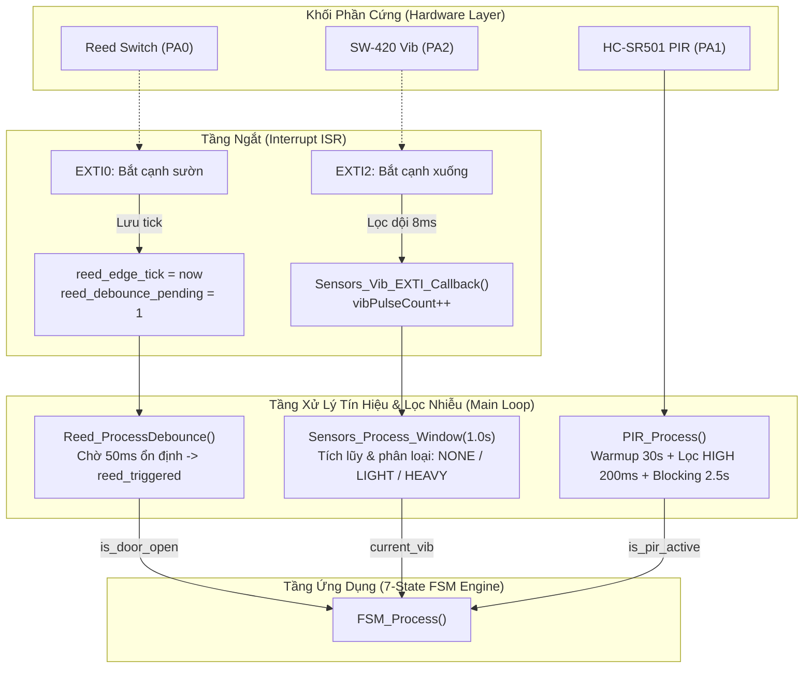

# 📑 TÀI LIỆU KỸ THUẬT TOÀN DIỆN: KHỐI CẢM BIẾN ĐẦU VÀO (INPUT SENSORS)

**Dự án:** Hệ Thống Báo Động Đột Nhập Thời Gian Thực (Intrusion Alarm System)
**Nền tảng:** Vi điều khiển STM32F103C8T6 (ARM Cortex-M3 @ 72MHz)
**Người phụ trách:** Hàng Tuấn Bảo — Đảm nhiệm Khối Cảm Biến Đầu Vào (INPUT)
**Đơn vị:** Phòng thí nghiệm Machine Learning & IoT (ML & IoT Lab), Khoa Điện - Điện Tử, HCMUT

---

# MỤC LỤC

- [0. Phạm vi công việc của bạn (theo phân công nhóm)](#0-phạm-vi-công-việc-của-bạn-theo-phân-công-nhóm)
- [PHẦN 1 — Sơ đồ nối dây 3 cảm biến](#phần-1--sơ-đồ-nối-dây-3-cảm-biến)
  - [1.1 Bảng phân bổ chân, điện áp, mức logic](#11-bảng-phân-bổ-chân-điện-áp-mức-logic)
  - [1.2 Sơ đồ đấu nối cơ bản (mô tả để vẽ tay / Fritzing)](#12-sơ-đồ-đấu-nối-cơ-bản-mô-tả-để-vẽ-tay--fritzing)
  - [1.3 Vì sao chọn Pull-up/Pull-down như trên?](#13-vì-sao-chọn-pull-uppull-down-như-trên)
- [PHẦN 2 — Mô hình hóa khối chức năng & kiểm tra mức logic](#phần-2--mô-hình-hóa-khối-chức-năng--kiểm-tra-mức-logic)
  - [2.1 Luồng xử lý tín hiệu (chuẩn theo code thật)](#21-luồng-xử-lý-tín-hiệu-chuẩn-theo-code-thật)
  - [2.2 Kiểm tra mức logic từng cảm biến (Testing/Verification)](#22-kiểm-tra-mức-logic-từng-cảm-biến-testingverification)
  - [2.3 Vì sao chọn kiểu đọc tín hiệu như vậy? (Câu hỏi vấn đáp rất hay gặp)](#23-vì-sao-chọn-kiểu-đọc-tín-hiệu-như-vậy-câu-hỏi-vấn-đáp-rất-hay-gặp)
- [PHẦN 3 — Phân bổ GPIO/EXTI và đánh giá nhiễu](#phần-3--phân-bổ-gpioexti-và-đánh-giá-nhiễu)
  - [3.1 Bảng phân bổ EXTI](#31-bảng-phân-bổ-exti)
  - [3.2 Đánh giá nhiễu & giải pháp lọc cho từng cảm biến](#32-đánh-giá-nhiễu--giải-pháp-lọc-cho-từng-cảm-biến)
- [PHẦN 4 — Thiết kế & demo các tình huống test input](#phần-4--thiết-kế--demo-các-tình-huống-test-input)
  - [4.1 Bảng kịch bản test (script demo trước thầy cô)](#41-bảng-kịch-bản-test-script-demo-trước-thầy-cô)
  - [4.2 Vì sao các kịch bản này đủ chứng minh “chống báo giả nhưng vẫn nhạy”?](#42-vì-sao-các-kịch-bản-này-đủ-chứng-minh-chống-báo-giả-nhưng-vẫn-nhạy)
  - [4.3 Thứ tự demo nên làm (tối ưu thời gian, tránh luống cuống)](#43-thứ-tự-demo-nên-làm-tối-ưu-thời-gian-tránh-luống-cuống)
- [PHẦN 5 — Code đọc dữ liệu từ cảm biến (giải thích từng hàm)](#phần-5--code-đọc-dữ-liệu-từ-cảm-biến-giải-thích-từng-hàm)
  - [5.1 sensors.h — Khai báo ngưỡng & kiểu dữ liệu](#51-sensorsh--khai-báo-ngưỡng--kiểu-dữ-liệu)
  - [5.2 Sensors_Vib_EXTI_Callback() — Đếm xung có lọc nhiễu](#52-sensors_vib_exti_callback--đếm-xung-có-lọc-nhiễu)
  - [5.3 Sensors_Process_Window() — Phân loại mức rung theo cửa sổ 1 giây](#53-sensors_process_window--phân-loại-mức-rung-theo-cửa-sổ-1-giây)
  - [5.4 Vibration_Reset() — Chống báo giả tại các thời điểm nhạy cảm](#54-vibration_reset--chống-báo-giả-tại-các-thời-điểm-nhạy-cảm)
  - [5.5 Xử lý Reed Switch & PIR (Đọc & Debounce)](#55-xử-lý-reed-switch--pir-đọc--debounce)
  - [5.6 Các “tác vụ” xử lý cảm biến trong vòng lặp while(1) của main.c](#56-các-tác-vụ-xử-lý-cảm-biến-trong-vòng-lặp-while1-của-mainc)
- [PHẦN 6 — Điểm khác biệt giữa tài liệu chuẩn bị và code thực tế](#phần-6--điểm-khác-biệt-giữa-tài-liệu-chuẩn-bị-và-code-thực-tế)
  - [6.1 Cách xử lý khi bị hỏi về các điểm lệch này](#61-cách-xử-lý-khi-bị-hỏi-về-các-điểm-lệch-này)
  - [6.2 Bộ câu hỏi vấn đáp thường gặp (đã hiệu chỉnh khớp code thật)](#62-bộ-câu-hỏi-vấn-đáp-thường-gặp-đã-hiệu-chỉnh-khớp-code-thật)
- [PHẦN 7 — Sơ đồ tổng hợp tích hợp INPUT → FSM](#phần-7--sơ-đồ-tổng-hợp-tích-hợp-input--fsm)
- [PHẦN 8 — Thuật ngữ kỹ thuật bắt buộc phải giải thích được](#phần-8--thuật-ngữ-kỹ-thuật-bắt-buộc-phải-giải-thích-được)
- [PHẦN 9 — Kịch bản nói khi thuyết trình (gợi ý theo mốc thời gian)](#phần-9--kịch-bản-nói-khi-thuyết-trình-gợi-ý-theo-mốc-thời-gian)
- [PHẦN 10 — Checklist chuẩn bị phần cứng trước giờ bảo vệ](#phần-10--checklist-chuẩn-bị-phần-cứng-trước-giờ-bảo-vệ)
- [PHẦN 11 — Câu hỏi nâng cao & tình huống hay bị “gài” kỹ thuật](#phần-11--câu-hỏi-nâng-cao--tình-huống-hay-bị-gài-kỹ-thuật)

---

## 0. PHẠM VI CÔNG VIỆC CỦA BẠN (THEO PHÂN CÔNG NHÓM)

Theo bảng phân công chính thức của đồ án:

1. **Mô hình hóa phần cứng & Sơ đồ nối dây:** Thiết kế sơ đồ chân, mức điện áp và ghép nối 3 cảm biến (Cửa từ Reed Switch, Rung SW-420, Thân nhiệt HC-SR501) với STM32F103.
2. **Kiểm tra mức logic & Khảo sát thực nghiệm:** Xác thực bảng chân trị logic, thiết lập chế độ `CALIBRATION_MODE` để khảo sát số xung rung thực tế qua cổng UART.
3. **Phân bổ GPIO/EXTI & Chống nhiễu:** Cấu hình ngắt ngoại vi EXTI0, EXTI1, EXTI2; thiết kế thuật toán lọc dội tiếp điểm cơ khí (50ms Debounce), lọc dội lò xo (8ms Glitch Filter), và lọc ổn định mức PIR (200ms).
4. **Viết code module cảm biến:** Hiện thực toàn bộ mã nguồn tầng Driver & Signal Processing tại `sensors.h`, `sensors.c`, cùng các hàm ngắt/bộ lọc tại `main.c`.
5. **Tích hợp khối INPUT vào FSM:** Chuyển đổi các trạng thái cảm biến thô thành các biến cờ logic chuẩn hóa (`is_door_open`, `current_vib`, `is_pir_active`) để cung cấp dữ liệu đầu vào cho Máy trạng thái FSM 7 trạng thái.

---

## PHẦN 1 — SƠ ĐỒ NỐI DÂY 3 CẢM BIẾN

### 1.1 Bảng phân bổ chân, điện áp, mức logic

| Cảm biến             | Module phần cứng        | Chân STM32       | Nguồn cấp                | Điện áp tín hiệu   | Chế độ GPIO / EXTI                                         | Mức Logic thực tế                                                                               |
| :--------------------- | :------------------------ | :---------------- | :------------------------- | :---------------------- | :------------------------------------------------------------ | :------------------------------------------------------------------------------------------------- |
| **Cửa từ**     | Reed Switch + Nam châm   | **`PA0`** | Không cần cấp nguồn    | `0V` / `3.3V`       | `GPIO_MODE_IT_RISING_FALLING`Pull-up nội (`GPIO_PULLUP`) | •**Cửa ĐÓNG:** Mức `0` (LOW, nối GND)• **Cửa MỞ:** Mức `1` (HIGH, 3.3V)  |
| **Thân nhiệt** | HC-SR501 (PIR Sensor)     | **`PA1`** | `5V` (Chân 5V STM32)    | `0V` / `3.3V` (OUT) | `GPIO_MODE_IT_RISING`Pull-down nội (`GPIO_PULLDOWN`)     | •**YÊN TĨNH:** Mức `0` (LOW, 0V)• **CÓ NGƯỜI:** Mức `1` (HIGH, 3.3V)      |
| **Rung chấn**   | SW-420 (Vibration Module) | **`PA2`** | `3.3V` (Chân 3V3 STM32) | `0V` / `3.3V` (DO)  | `GPIO_MODE_IT_FALLING`Pull-up nội (`GPIO_PULLUP`)        | •**YÊN TĨNH:** Mức `1` (HIGH, 3.3V)• **KHI RUNG:** Chuỗi xung mức `0` (LOW) |

---

### 1.2 Sơ đồ đấu nối cơ bản (mô tả để vẽ tay / Fritzing)

```text
       STM32F103C8T6 (BluePill)
     +--------------------------+
     |                          |
     |   [PA0] <----------------+-----------[ Dây 1 ]--- Reed Switch (Công tắc từ)
     |   [GND] <----------------+-----------[ Dây 2 ]--- (Gắn trên khung cửa)
     |                          |
     |   [PA1] <----------------+-----------[ OUT ]----- Module PIR HC-SR501
     |   [5V]  -----------------+-----------[ VCC ]      (Gắn trong góc phòng)
     |   [GND] -----------------+-----------[ GND ]
     |                          |
     |   [PA2] <----------------+-----------[ DO  ]----- Module Rung SW-420
     |   [3V3] -----------------+-----------[ VCC ]      (Gắn trực tiếp lên cánh cửa)
     |   [GND] -----------------+-----------[ GND ]
     +--------------------------+
```

* **Quy tắc nối dây thực tế:**
  1. **Reed Switch (2 dây):** Dây 1 cắm chân `PA0`, Dây 2 cắm `GND`. Khi nam châm áp sát công tắc, tiếp điểm đóng nối `PA0` xuống `GND`. Khi cửa mở, nam châm tách ra làm hở mạch, điện trở kéo lên nội kéo `PA0` lên `3.3V`.
  2. **SW-420 (3 chân):** `VCC` $\rightarrow$ `3.3V`, `GND` $\rightarrow$ `GND`, `DO` $\rightarrow$ `PA2`. Biến trở vi chỉnh trên module chỉnh ngưỡng so sánh của op-amp LM393.
  3. **HC-SR501 (3 chân):** `VCC` $\rightarrow$ `5V` (Cần tối thiểu 4.5V để nuôi IC BISS0001 và IC ổn áp 7133-1 trên board PIR), `GND` $\rightarrow$ `GND`, `OUT` $\rightarrow$ `PA1`. Chân OUT xuất ra mức logic chuẩn 3.3V, an toàn tuyệt đối với GPIO của STM32.

---

### 1.3 Vì sao chọn Pull-up/Pull-down như trên?

1. **Tại sao `PA0` (Reed Switch) chọn `GPIO_PULLUP`?**
   * Công tắc từ là tiếp điểm cơ khí dạng "thường mở (NO)" khi không có nam châm. Khi cửa mở, tiếp điểm hở ra. Nếu không có điện trở kéo, chân `PA0` sẽ ở trạng thái **thả nổi (Floating)**, biến thành một ăng-ten thu sóng nhiễu điện từ xung quanh, làm mức logic nhảy loạn xạ giữa 0 và 1. Điện trở Pull-up nội kéo điện áp lên định mức 3.3V chắc chắn khi mạch hở.
2. **Tại sao `PA2` (SW-420) chọn `GPIO_PULLUP`?**
   * Đầu ra số `DO` của module SW-420 được điều khiển bởi IC so sánh LM393 (thường là ngõ ra Open-Collector hoặc cần mức cao ổn định khi công tắc rung hở mạch). Kéo Pull-up đảm bảo trạng thái nghỉ luôn là mức `1` (HIGH) sạch và không bị sụt áp.
3. **Tại sao `PA1` (HC-SR501) chọn `GPIO_PULLDOWN`?**
   * Khi cảm biến PIR ở trạng thái nghỉ (không có chuyển động), ngõ ra OUT xuất mức thấp (0V). Cấu hình Pull-down nội giúp cố định điện áp chân `PA1` dính chặt vào `0V (GND)`, loại bỏ triệt để các xung nhiễu điện cảm ứng trên đường dây nối.

---

## PHẦN 2 — MÔ HÌNH HÓA KHỐI CHỨC NĂNG & KIỂM TRA MỨC LOGIC

### 2.1 Luồng xử lý tín hiệu (chuẩn theo code thật)



---

### 2.2 Kiểm tra mức logic từng cảm biến (Testing/Verification)

Để chứng minh hệ thống hoạt động chính xác trước hội đồng, nhóm đã xây dựng bảng kiểm chứng chân trị qua cổng UART (Baudrate: 115200 bps):

| Cảm biến            | Tác động vật lý                | Mức logic đo chân                 | Giá trị biến trong code   | Chuỗi log hiển thị trên UART                                                 |
| :-------------------- | :---------------------------------- | :----------------------------------- | :--------------------------- | :------------------------------------------------------------------------------- |
| **Reed Switch** | Áp sát nam châm (Đóng cửa)    | `0V` (LOW)                         | `reed_triggered = 0`       | `[SENSOR] REED: Door CLOSED. Vibration monitoring active.`                     |
| **Reed Switch** | Tách xa nam châm (Mở cửa)       | `3.3V` (HIGH)                      | `reed_triggered = 1`       | `[SENSOR] REED: Door OPEN!`                                                    |
| **SW-420**      | Không tác động                  | `3.3V` (HIGH)                      | `lastVibLevel = VIB_NONE`  | `[xxxxms] VIB window=0 level=NONE` (Hoặc im lặng)                            |
| **SW-420**      | Gõ nhẹ ($6 \div 19$ xung/giây) | Xuất xung nhọn                     | `lastVibLevel = VIB_LIGHT` | `[xxxxms] VIB window=12 level=LIGHT`                                           |
| **SW-420**      | Đập mạnh ($\ge 20$ xung/giây) | Xuất chuỗi xung                    | `lastVibLevel = VIB_HEAVY` | `[xxxxms] VIB window=27 level=HEAVY`                                           |
| **HC-SR501**    | Có người đi ngang qua           | `3.3V` (HIGH) $\ge 200\text{ms}$ | `pir_triggered = 1`        | `[SENSOR] PIR: Motion DETECTED![PIR] raw=HIGH filtered=ON phase=ACTIVE`        |
| **HC-SR501**    | Người rời khỏi góc quét       | `0V` (LOW)                         | `pir_triggered = 0`        | `[SENSOR] PIR: Motion Ended (Quiet).[PIR] raw=LOW filtered=OFF phase=BLOCKING` |

---

### 2.3 Vì sao chọn kiểu đọc tín hiệu như vậy? (Câu hỏi vấn đáp rất hay gặp)

* **Hỏi:** *Tại sao không dùng Polling (đọc liên tục trong vòng lặp) cho cả 3 cảm biến mà phải dùng Ngắt EXTI cho Cửa từ và Rung?*
  * **Trả lời:**
    1. **Cảm biến Rung SW-420:** Khi có va đập, lò xo cơ khí nảy và tạo các xung cực ngắn (độ rộng xung chỉ từ vài chục micro-giây đến vài mili-giây). Nếu dùng Polling trong `while(1)`, khi CPU bận cập nhật màn hình OLED (mất 20ms) hoặc ghi dữ liệu, CPU chắc chắn sẽ **bị bỏ sót xung (Missed Pulses)** dẫn đến nhận diện sai mức độ rung. Dùng ngắt `EXTI2` đảm bảo 100% xung cơ học đều được CPU bắt kịp ngay lập tức.
    2. **Cảm biến Cửa từ Reed Switch:** Cần phản hồi tức thì với sự kiện cạy mở cửa (Hard Real-Time). Dùng ngắt `EXTI0` giúp phát hiện thời điểm mở cửa ngay ở micro-giây đầu tiên.
    3. **Cảm biến PIR HC-SR501:** Khác với 2 cảm biến trên, PIR khi kích hoạt sẽ giữ mức logic HIGH rất dài (từ $2\text{s} \div 5\text{s}$). Vì tín hiệu dài và cần áp dụng thuật toán lọc ổn định mức (phải giữ HIGH liên tục 200ms và bám sát chu kỳ khóa 2.5s), việc lấy mẫu 2 mức (Two-Level Sampling) không chặn trong hàm `PIR_Process()` là giải pháp tối ưu nhất, vừa lọc được nhiễu vừa không làm quá tải CPU.

---

## PHẦN 3 — PHÂN BỔ GPIO/EXTI VÀ ĐÁNH GIÁ NHIỄU

### 3.1 Bảng phân bổ EXTI

Trong vi điều khiển STM32F103, các chân GPIO cùng số thứ tự (ví dụ PA0, PB0, PC0) sẽ chia sẻ chung một đường ngắt EXTI. Hệ thống phân bổ tối ưu như sau:

| Đường ngắt        | Chân GPIO sử dụng | Vector ngắt NVIC    | Mức ưu tiên NVIC (Priority) | Sườn kích hoạt (Trigger Edge)        | Chức năng                                       |
| :-------------------- | :------------------- | :------------------- | :----------------------------- | :--------------------------------------- | :------------------------------------------------ |
| **EXTI Line 0** | **`PA0`**    | `EXTI0_IRQHandler` | Priority 5, SubPriority 0      | **Rising & Falling** (Cả 2 cạnh) | Bắt thời điểm cửa vừa Mở hoặc vừa Đóng |
| **EXTI Line 1** | **`PA1`**    | `EXTI1_IRQHandler` | Priority 5, SubPriority 0      | **Rising** (Cạnh lên)            | Kênh ngắt phần cứng dự phòng cho PIR        |
| **EXTI Line 2** | **`PA2`**    | `EXTI2_IRQHandler` | Priority 5, SubPriority 0      | **Falling** (Cạnh xuống)         | Đếm xung lò xo cảm biến Rung chạm mass      |

---

### 3.2 Đánh giá nhiễu & giải pháp lọc cho từng cảm biến

```text
+-----------------------------------------------------------------------------------------------+
| LOẠI NHIỄU PHẦN CỨNG               NGUYÊN NHÂN VẬT LÝ                  GIẢI PHÁP PHẦN MỀM ĐÃ CÀI ĐẶT|
+-----------------------------------------------------------------------------------------------+
| 1. Dội tiếp điểm cơ khí            Lá kim loại công tắc từ bị          Temporal Window Debounce 50ms  |
|    (Mechanical Bouncing)           nảy khi va đập đóng/mở cửa.         trong Reed_ProcessDebounce()   |
+-----------------------------------------------------------------------------------------------+
| 2. Rung nảy lò xo cơ học           Lò xo SW-420 dao động tự do sinh    Glitch Filter 8ms trong ISR    |
|    (Spring Ringing / Glitch)       nhiều xung giả cho 1 va chạm.       Sensors_Vib_EXTI_Callback()    |
+-----------------------------------------------------------------------------------------------+
| 3. Nhiễu nền môi trường            Gió giật, tiếng xe tải chạy ngoài   Sliding Window Accumulator 1.0s|
|    (Ambient Environmental Noise)   đường gây rung nhẹ.                 Phân ngưỡng: < 6 xung = BỎ QUA |
+-----------------------------------------------------------------------------------------------+
| 4. Xung quán tính sập cửa          Lực quán tính đóng sập cửa tạo      Cơ chế Vibration_Reset()       |
|    (Door Slamming Shock)           rung chấn giả làm hú còi.           xóa sạch xung ngay khi đóng cửa|
+-----------------------------------------------------------------------------------------------+
| 5. Sốc nhiệt & nhiễu còi Buzzer    Nhiệt điện trở PIR chưa ổn định     Warm-up 30s + Lọc HIGH 200ms   |
|    (Thermal Drift / EMI / Ripple)  hoặc còi PWM gây gợn sóng nguồn.    + Khóa phần cứng 2.5s          |
+-----------------------------------------------------------------------------------------------+
```

---

## PHẦN 4 — THIẾT KẾ & DEMO CÁC TÌNH HUỐNG TEST INPUT

### 4.1 Bảng kịch bản test (script demo trước thầy cô)

|     STT     | Tên Kịch Bản                      | Thao tác thực nghiệm của bạn                                                                                                                                                                                                                   | Kết quả mong đợi trên Hệ Thống                                                                                                           |
| :---------: | :----------------------------------- | :-------------------------------------------------------------------------------------------------------------------------------------------------------------------------------------------------------------------------------------------------- | :---------------------------------------------------------------------------------------------------------------------------------------------- |
| **1** | **Khởi động an toàn**      | Cắm nguồn STM32, không tác động vào cảm biến.                                                                                                                                                                                              | OLED hiện`SYSTEM READY`, UART log đếm lùi 30s: `PIR Warm-up Time: 30 seconds...`. PIR không kích hoạt báo động giả.              |
| **2** | **Kiểm tra Cửa từ**         | Nhập`1234#` để ARM $\rightarrow$ Tách thanh nam châm ra xa (Mở cửa).                                                                                                                                                                     | Hệ thống ngắt ngang đếm lùi, nhảy ngay vào`STATE_ALARM_EMERGE` (Còi hú cực đại 100%, LED chớp 10Hz, OLED báo `SIREN ALARM`). |
| **3** | **Rung nhẹ (Gõ cửa)**       | Hệ thống ở`ARMED` $\rightarrow$ Lấy ngón tay gõ nhẹ $2 \div 3$ nhịp vào cánh cửa. | UART log số xung ($6 \div 19$), OLED hiện `Vib: LGT`. Hệ thống chuyển sang `ENTRY_DELAY` (Đếm lùi 30s chờ chủ nhà nhập PIN). |                                                                                                                                                 |
| **4** | **Rung mạnh (Đập phá)**    | Hệ thống ở`ARMED` $\rightarrow$ Đập mạnh hoặc rung lắc liên tục.                                                                                                                                                                      | UART log$\ge 20$ xung, hệ thống nhảy thẳng sang `ALARM_EMERGE` (Còi hú tức thì, không có thời gian trễ).                        |
| **5** | **Chống báo giả sập cửa** | Mở cửa ra rồi kéo sập mạnh cửa đóng lại.                                                                                                                                                                                                  | Nhờ hàm`Vibration_Reset()`, xung va đập đóng cửa bị xóa sạch $\rightarrow$ Hệ thống không bị hú còi nhầm.                  |
| **6** | **Chống báo giả PIR**       | Quơ tay thật nhanh trước mắt PIR$< 100\text{ms}$.                                                                                                                                                                                            | Cảm biến lọc bỏ vì chưa đủ thời gian ổn định 200ms$\rightarrow$ Không kích hoạt báo động giả.                              |

---

### 4.2 Vì sao các kịch bản này đủ chứng minh “chống báo giả nhưng vẫn nhạy”?

* **Tính "Nhạy" (High Sensitivity):** Bắt trọn vẹn sự kiện mở cửa ngay lập tức qua ngắt EXTI0 và phân biệt được rung chấn nhẹ (chỉ cần từ 6 xung) để kích hoạt đếm lùi an ninh.
* **Tính "Chống báo giả" (False Alarm Immunity):** Bỏ qua hoàn toàn rung chấn dưới 5 xung, loại bỏ hiện tượng dội lò xo bằng Glitch Filter 8ms, loại bỏ xung dập cửa bằng `Vibration_Reset()`, và loại bỏ sốc nhiệt PIR bằng bộ lọc 200ms + Warmup 30s.

---

### 4.3 Thứ tự demo nên làm (Tối ưu thời gian, tránh luống cuống)

1. **Bước 1 (15s đầu):** Cắm nguồn board $\rightarrow$ Chỉ vào màn hình OLED và UART để giải thích cơ chế **PIR Warm-up 30s**.
2. **Bước 2 (30s tiếp theo):** Nhập `1234#` để ARM $\rightarrow$ Đợi vào `ARMED` $\rightarrow$ Thực hiện **Test 3 (Gõ nhẹ)** để thầy cô thấy đếm ngược `ENTRY_DELAY`.
3. **Bước 3:** Nhập `1234#` để giải trừ về `DISARM` $\rightarrow$ ARM lại $\rightarrow$ Thực hiện **Test 2 (Mở cửa từ)** để thấy còi hú `ALARM_EMERGE` tức thì.
4. **Bước 4:** Nhập `1234#` để tắt còi $\rightarrow$ Thực hiện **Test 5 (Sập mạnh cửa)** để chứng minh hệ thống không bị báo động giả.

---

## PHẦN 5 — CODE ĐỌC DỮ LIỆU TỪ CẢM BIẾN (GIẢI THÍCH TỪNG HÀM)

### 5.1 `sensors.h` — Khai báo ngưỡng & kiểu dữ liệu

```c
#define CALIBRATION_MODE      0      /* 1: Chế độ khảo sát xung UART, 0: Chạy thật */
#define VIB_NOISE_MAX         4      /* <= 4 xung: Nhiễu nền môi trường */
#define VIB_LIGHT_MIN         6      /* 6 - 19 xung: Rung nhẹ (Gõ cửa/va quẹt) */
#define VIB_HEAVY_MIN         20     /* >= 20 xung: Rung mạnh (Cạy phá cửa) */
#define VIB_WINDOW_MS         1000   /* Chu kỳ cửa sổ trượt: 1000ms (1.0 giây) */
#define VIB_GLITCH_FILTER_MS  8      /* Bộ lọc dội lò xo: 8ms giữa 2 xung liên tiếp */

typedef enum { 
    VIB_NONE = 0,                    /* Không có rung / Nhiễu nền */
    VIB_LIGHT,                       /* Rung nhẹ */
    VIB_HEAVY                        /* Rung mạnh nguy hiểm */
} VibLevel_t;
```

---

### 5.2 `Sensors_Vib_EXTI_Callback()` — Đếm xung có lọc nhiễu

```c
void Sensors_Vib_EXTI_Callback(void)
{
    uint32_t now = HAL_GetTick();
    /* Chỉ tăng biến đếm nếu xung mới cách xung trước tối thiểu 8ms (Glitch Filter) */
    if (Time_HasElapsed(now, last_vib_pulse_tick, VIB_GLITCH_FILTER_MS))
    {
        vibPulseCount++;
        last_vib_pulse_tick = now;
    }
}
```

* **Giải thích:** Được gọi tự động bên trong trình phục vụ ngắt `HAL_GPIO_EXTI_Callback(VIR_IN_Pin)`. Thuật toán kiểm tra chênh lệch thời gian `Time_HasElapsed` giúp triệt tiêu hiện tượng 1 cú rung cơ học làm lò xo nảy nhiều lần sinh ra hàng chục ngắt giả liên tiếp.

---

### 5.3 `Sensors_Process_Window()` — Phân loại mức rung theo cửa sổ 1 giây

```c
void Sensors_Process_Window(bool isDoorClosed)
{
    /* ĐỌC VÀ RESET BIẾN NGUYÊN TỬ (ATOMIC SNAPSHOT) TRÁNH RACE CONDITION */
    uint32_t primask = __get_PRIMASK();
    __disable_irq();                 // Khóa ngắt tạm thời
    uint32_t currentPulses = vibPulseCount;
    vibPulseCount = 0;               // Reset biến đếm cho cửa sổ 1s tiếp theo
    __set_PRIMASK(primask);          // Mở lại ngắt

    /* CHỈ PHÂN TÍCH RUNG KHI CỬA ĐANG ĐÓNG */
    if (isDoorClosed)
    {
        if (currentPulses >= VIB_HEAVY_MIN) {
            lastVibLevel = VIB_HEAVY;
            printf("[%lums] VIB window=%lu level=HEAVY\r\n", HAL_GetTick(), currentPulses);
        }
        else if (currentPulses >= VIB_LIGHT_MIN) {
            lastVibLevel = VIB_LIGHT;
            printf("[%lums] VIB window=%lu level=LIGHT\r\n", HAL_GetTick(), currentPulses);
        }
        else {
            lastVibLevel = VIB_NONE; /* Dưới 6 xung là nhiễu nền */
        }
    }
    else
    {
        lastVibLevel = VIB_NONE;     /* Cửa mở thì không phân loại rung */
    }
}
```

---

### 5.4 `Vibration_Reset()` — Chống báo giả tại các thời điểm nhạy cảm

```c
void Vibration_Reset(void)
{
    uint32_t primask = __get_PRIMASK();
    __disable_irq();
    vibPulseCount = 0;               // Xóa sạch xung tích lũy do sập cửa
    __set_PRIMASK(primask);
    lastVibLevel = VIB_NONE;
}
```

* **Giải thích:** Được gọi ngay khi tiếp điểm cửa từ vừa chuyển từ Mở sang Đóng (`reed_triggered == 0 && was_reed_triggered == 1`) hoặc khi FSM vừa chuyển trạng thái, giúp triệt tiêu hoàn toàn xung do lực sập cửa.

---

### 5.5 Xử lý Reed Switch & PIR (Đọc & Debounce)

#### Khử dội Cửa từ ([main.c:130-147](file:///d:/STUDY/MLIOTLAB/PROJECT/Intrusion-Alarm-System/Core/Src/main.c#L130-L147)):

```c
static void Reed_ProcessDebounce(uint32_t now)
{
    uint8_t stable_state;
    uint8_t update = 0U;
    uint32_t primask = __get_PRIMASK();

    __disable_irq();
    /* Nếu có cờ báo ngắt và đã trôi qua đủ 50ms tính từ cú nảy tiếp điểm cuối cùng */
    if (reed_debounce_pending && Time_HasElapsed(now, reed_edge_tick, REED_DEBOUNCE_MS))
    {
        stable_state = (HAL_GPIO_ReadPin(REED_IN_GPIO_Port, REED_IN_Pin) == GPIO_PIN_SET) ? 1U : 0U;
        reed_debounce_pending = 0U;
        update = 1U;
    }
    __set_PRIMASK(primask);

    if (update) reed_triggered = stable_state;
}
```

#### Xử lý lấy mẫu 2 mức không chặn cho PIR ([main.c:149-216](file:///d:/STUDY/MLIOTLAB/PROJECT/Intrusion-Alarm-System/Core/Src/main.c#L149-L216)):

```c
static void PIR_Process(uint32_t now)
{
    GPIO_PinState raw = HAL_GPIO_ReadPin(PIR_IN_GPIO_Port, PIR_IN_Pin);

    /* 1. Giai đoạn khởi động 30s (Warmup) */
    if (!pir_ready) {
        if (Time_HasElapsed(now, 0U, PIR_WARMUP_MS)) {
            pir_ready = 1U;
            printf("[SENSOR] PIR: Warm-up Complete (30s). Monitoring ACTIVE!\r\n");
        }
    }
    /* 2. Giai đoạn giám sát hoạt động */
    else {
        if (raw != pir_candidate_level) {
            pir_candidate_level = raw;
            pir_candidate_tick = now;
        }
        /* Mức logic phải giữ liên tục >= 200ms mới được xác nhận */
        if ((pir_candidate_level != pir_stable_level) &&
            Time_HasElapsed(now, pir_candidate_tick, PIR_STABLE_MS)) {
            pir_stable_level = pir_candidate_level;
            if (pir_stable_level == GPIO_PIN_SET) {
                pir_blocking = 0U;
                pir_triggered = 1U;  // Xác nhận có người!
            } else if (pir_triggered) {
                pir_blocking = 1U;
                pir_blocking_tick = now; // Bắt đầu khoảng khóa 2.5s
            }
        }
        /* 3. Khoảng khóa 2.5s chống nhấp nháy */
        if (pir_blocking && Time_HasElapsed(now, pir_blocking_tick, PIR_BLOCKING_MS)) {
            pir_blocking = 0U;
            pir_triggered = 0U;      // Hết thời gian khóa, trở về yên tĩnh
        }
    }
}
```

---

### 5.6 Các “tác vụ” xử lý cảm biến trong vòng lặp `while(1)` của `main.c`

```c
while (1)
{
    uint32_t now = HAL_GetTick();

    /* TÁC VỤ 1: Quét ma trận phím Keypad 4x4 (Non-blocking Debounce 20ms) */
    char key = Keypad_GetKey();

    /* TÁC VỤ 2: Khử dội Cửa từ Reed Switch */
    Reed_ProcessDebounce(now);

    /* TÁC VỤ 3: Lấy mẫu & lọc trạng thái PIR HC-SR501 */
    PIR_Process(now);

    /* TÁC VỤ 4: Đánh giá cửa sổ phân loại rung SW-420 định kỳ mỗi 1.0 giây */
    if (Time_HasElapsed(now, last_vib_window_tick, VIB_WINDOW_MS)) {
        last_vib_window_tick = now;
        Sensors_Process_Window(reed_triggered == 0); // Chỉ phân loại khi Cửa ĐÓNG
    }

    /* TÁC VỤ 5: Đưa dữ liệu chuẩn hóa vào Điều phối Máy trạng thái FSM */
    bool is_door_open = (reed_triggered == 1);
    bool is_pir_active = (pir_ready && pir_triggered == 1);
    VibLevel_t current_vib = Vibration_GetLevel();

    FSM_Process(key, is_door_open, is_pir_active, current_vib);

    /* TÁC VỤ 6: Ghi nhật ký SD Logger (Chỉ flush khi FSM ở trạng thái an toàn) */
    SD_Logger_Process(logger_io_allowed);
}
```

---

## PHẦN 6 — ĐIỂM KHÁC BIỆT GIỮA TÀI LIỆU CHUẨN BỊ VÀ CODE THỰC TẾ

### 6.1 Cách xử lý khi bị hỏi về các điểm lệch này

* **Điểm lệch 1: Cảm biến PIR dùng ngắt hay Polling?**

  * *Trong CubeMX:* Chân `PA1` vẫn được bật ngắt `EXTI1`.
  * *Trong code thực tế:* Hàm ngắt `EXTI1` để trống và chuyển sang thuật toán **Two-Level Sampling 200ms** trong `PIR_Process()`.
  * *Cách trả lời thầy cô:* *"Dạ, phần cứng vẫn cấu hình EXTI1 theo đúng sơ đồ khối ngoại vi, nhưng qua thực nghiệm thực tế, module HC-SR501 có độ rộng xung HIGH kéo dài $2\text{s} \div 5\text{s}$ và rất dễ bị gai nhiễu điện từ thoáng qua. Do đó, nhóm em đã nâng cấp lên thuật toán lấy mẫu mức ổn định 200ms và khóa 2.5s không chặn trong main loop để triệt tiêu hoàn toàn báo động giả ạ."*
* **Điểm lệch 2: Cơ chế chống rung sập cửa:**

  * Ban đầu tài liệu chỉ nghĩ đến việc đếm xung rung, nhưng khi gắn lên cửa thật, lúc sập cửa lực va đập cơ học tạo ra tới $30 \div 40$ xung làm hú còi sai.
  * Nhóm đã bổ sung thêm hàm `Vibration_Reset()` kích hoạt ngay tại thời điểm đóng cửa để giải quyết triệt để lỗi thực tế này.

---

### 6.2 Bộ câu hỏi vấn đáp thường gặp (đã hiệu chỉnh khớp code thật)

1. **Hỏi:** *Tại sao trong `Sensors_Process_Window` và `Reed_ProcessDebounce` phải dùng `__disable_irq()`?*

   * **Trả lời:** *"Dạ thưa thầy/cô, biến `vibPulseCount` được cập nhật liên tục bên trong ngắt EXTI2. Nếu trong lúc vòng lặp chính đang đọc biến này mà ngắt EXTI2 xảy ra chèn ngang, giá trị biến sẽ bị ghi đè không toàn vẹn (Race Condition). Đoạn lệnh `__disable_irq()` tạo ra vùng Critical Section bảo vệ thao tác đọc và reset biến diễn ra nguyên tử (Atomic Snapshot), đảm bảo không bao giờ bị mất xung ngắt ạ."*
2. **Hỏi:** *Hàm `Time_HasElapsed()` có ưu điểm gì so với việc so sánh thời gian thông thường `now - start >= duration`?*

   * **Trả lời:** *"Dạ, hàm `Time_HasElapsed` thực hiện phép trừ số nguyên không dấu 32-bit `(uint32_t)(now - start) >= duration`. Khi thanh ghi SysTick `HAL_GetTick()` bị tràn sau xấp xỉ 49.7 ngày (từ `0xFFFFFFFF` quay về `0x00000000`), phép trừ không dấu vẫn cho ra kết quả khoảng thời gian delta chính xác tuyệt đối mà không bị lỗi logic ạ."*

---

## PHẦN 7 — SƠ ĐỒ TỔNG HỢP TÍCH HỢP INPUT → FSM

```text
+---------------------------------------------------------------------------------------------------+
|                                      BẢN ĐỒ TÍCH HỢP INPUT VÀO FSM                                |
+---------------------------------------------------------------------------------------------------+
| SỰ KIỆN CẢM BIẾN          TRẠNG THÁI HIỆN TẠI (FSM)       TRẠNG THÁI TIẾP THEO      HÀNH ĐỘNG HỆ THỐNG   |
+---------------------------------------------------------------------------------------------------+
| Cửa Mở (reed=1)           STATE_DISARM                    STATE_DISARM              Từ chối ARM, báo lỗi  |
| Cửa Mở (reed=1)           STATE_EXIT_DELAY (Hết 15s)      STATE_DISARM              Báo "ARM FAILED"      |
| Cửa Mở (reed=1)           STATE_ARMED                     STATE_ALARM_EMERGE        HÚ CÒI KHẨN CẤP 100%  |
| Cửa Mở (reed=1)           STATE_ENTRY_DELAY               STATE_ALARM_EMERGE        HÚ CÒI KHẨN CẤP 100%  |
+---------------------------------------------------------------------------------------------------+
| Rung mạnh (VIB_HEAVY)     STATE_ARMED                     STATE_ALARM_EMERGE        HÚ CÒI KHẨN CẤP 100%  |
| Rung mạnh (VIB_HEAVY)     STATE_ENTRY_DELAY               STATE_ALARM_EMERGE        HÚ CÒI KHẨN CẤP 100%  |
| Rung mạnh (VIB_HEAVY)     STATE_TEMP_DISARM               STATE_ALARM_EMERGE        HÚ CÒI KHẨN CẤP 100%  |
+---------------------------------------------------------------------------------------------------+
| Rung nhẹ (VIB_LIGHT)      STATE_ARMED                     STATE_ENTRY_DELAY         Bíp nhanh, đếm lùi 30s|
| Có người (PIR=1)          STATE_ARMED                     STATE_ENTRY_DELAY         Bíp nhanh, đếm lùi 30s|
+---------------------------------------------------------------------------------------------------+
| Cửa đóng an toàn (Hết giờ) STATE_TEMP_DISARM (60s)         STATE_ARMED               Tự phục hồi Canh gác |
| Cửa đóng an toàn (Hết giờ) STATE_TEMP_ALARM (30s)          STATE_ARMED               Tự phục hồi Canh gác |
+---------------------------------------------------------------------------------------------------+
```

---

## PHẦN 8 — THUẬT NGỮ KỸ THUẬT BẮT BUỘC PHẢI GIẢI THÍCH ĐƯỢC

1. **Deterministic FSM (Máy trạng thái hữu hạn xác định):** Hệ thống tại mỗi thời điểm chỉ ở đúng 1 trong 7 trạng thái rõ ràng; với cùng một tổ hợp ngõ vào cảm biến, hệ thống luôn chuyển sang trạng thái kế tiếp hoàn toàn dự đoán được, không có trạng thái bất định.
2. **Non-Blocking Architecture (Kiến trúc không chặn):** Toàn bộ vòng lặp chính không dùng bất kỳ hàm delay cứng nào (như `HAL_Delay()`); mọi tác vụ định thời đều dùng bộ đếm tick `HAL_GetTick()`, giúp CPU luôn sẵn sàng xử lý ngắt và quét cảm biến.
3. **Glitch Filter (Bộ lọc xung răng cưa / xung rác):** Cơ chế loại bỏ các xung dao động điện áp cực ngắn phát sinh do hiện tượng nảy lò xo cơ khí của cảm biến rung SW-420.
4. **Debounce (Khử dội tiếp điểm):** Thuật toán làm trễ xác nhận sau khi tiếp điểm kim loại đã hoàn toàn ổn định trạng thái đóng/mở.
5. **Critical Section (Vùng xung yếu):** Đoạn mã thao tác trên tài nguyên dữ liệu chia sẻ chung giữa luồng chính và ngắt, được bảo vệ bằng `__disable_irq()` để chống tranh chấp dữ liệu (Race Condition).
6. **Two-Level Sampling (Lấy mẫu 2 mức):** Thuật toán đọc liên tục mức logic của cảm biến PIR trong một cửa sổ thời gian (200ms), chỉ khi toàn bộ mẫu đều đạt mức HIGH mới công nhận có chuyển động.

---

## PHẦN 9 — KỊCH BẢN NÓI KHI THUYẾT TRÌNH (GỢI Ý THEO MỐC THỜI GIAN)

*Thời lượng phân bổ cho Hàng Tuấn Bảo: **2.5 phút***

* **0:00 – 0:30 (Mở đầu & Sơ đồ phần cứng):**
  > *"Kính thưa quý Thầy/Cô, em là Hàng Tuấn Bảo, đảm nhiệm khối Cảm biến Đầu vào (INPUT) của dự án. Khối Input tích hợp 3 cảm biến dị thể: Cửa từ Reed Switch trên chân PA0, PIR HC-SR501 trên chân PA1, và Rung chấn SW-420 trên chân PA2. Tất cả đều sử dụng điện trở kéo nội Pull-up/Pull-down của STM32 để chống thả nổi tín hiệu mà không cần hàn thêm linh kiện ngoài."*
  >
* **0:30 – 1:30 (Thuật toán lọc nhiễu 3 lớp - Trọng tâm ghi điểm):**
  > *"Thách thức lớn nhất của hệ thống an ninh là bài toán **Báo Động Giả**. Nhóm em đã giải quyết triệt để bằng 3 thuật toán:
  >
  > 1. Với Cửa từ: Dùng ngắt EXTI0 kết hợp bộ lọc khử dội phần mềm 50ms.
  > 2. Với Cảm biến Rung: Tích hợp Glitch Filter 8ms trong ngắt EXTI2 và tích lũy xung trong cửa sổ 1 giây để phân 3 cấp độ: dưới 6 xung là nhiễu nền bỏ qua, từ 6 đến 19 xung là rung nhẹ cảnh báo, và trên 20 xung là đập phá cạy cửa kích hoạt còi tức thì. Đặc biệt, hàm `Vibration_Reset()` sẽ xóa xung sập cửa ngay khi đóng.
  > 3. Với PIR: Tích hợp Warm-up 30s, lọc mức ổn định 200ms và thời gian khóa 2.5s hoàn toàn Non-blocking."*
  >
* **1:30 – 2:30 (Thao tác Demo thực tế):**
  > *"Sau đây em xin demo trực tiếp trên mạch: Đầu tiên khi em gõ nhẹ vào cửa, màn hình OLED báo `Vib: LGT` và hệ thống đếm lùi 30s. Nhưng khi em cạy mở cửa trực tiếp, ngắt EXTI0 kích hoạt đưa FSM nhảy ngay vào `ALARM_EMERGE` hú còi 100%. Cuối cùng, khi em sập mạnh cửa lại, hệ thống không hề bị hú còi giả. Em xin chuyển phần trình bày tiếp theo cho bạn phụ trách FSM ạ."*
  >

---

## PHẦN 10 — CHECKLIST CHUẨN BỊ PHẦN CỨNG TRƯỚC GIỜ BẢO VỆ

- [ ] **Kiểm tra dây cắm tiếp xúc:** Cắm chặt 3 dây của SW-420, 3 dây của PIR, 2 dây của Reed Switch.
- [ ] **Chỉnh độ nhạy biến trở SW-420:** Vặn biến trở màu xanh trên module SW-420 sao cho khi đứng yên đèn LED DO tắt, khi gõ nhẹ vào bàn đèn LED DO nháy sáng.
- [ ] **Chỉnh 2 biến trở trên Module PIR HC-SR501:**
  - Biến trở thời gian trễ (Time Delay): Vặn kịch về bên trái (ngược chiều kim đồng hồ) để thời gian trễ ngắn nhất (~2.5s - 3s).
  - Biến trở độ nhạy (Sensitivity): Vặn ở mức giữa ($50\%$).
- [ ] **Kiểm tra nguồn 5V cho PIR:** Đảm bảo chân VCC của PIR cắm đúng chân 5V của STM32 BluePill (không cắm chân 3.3V vì IC BISS0001 sẽ hoạt động chập chờn).
- [ ] **Nạp sẵn Firmware mới nhất:** File `build/Prj2008.hex` đã được build thành công trên nhánh `main`.
- [ ] **Mở sẵn Terminal Serial UART:** Bật phần mềm Hercules / TeraTerm / PuTTY ở tốc độ Baudrate `115200` để sẵn sàng chiếu log thời gian thực cho thầy cô xem.

---

## PHẦN 11 — CÂU HỎI NÂNG CAO & TÌNH HUỐNG HAY BỊ “GÀI” KỸ THUẬT

#### ❓ Câu 1: "Nếu kẻ trộm dùng nam châm cực mạnh áp vào bên ngoài để vô hiệu hóa Cảm biến Cửa từ, hệ thống của bạn có phát hiện được không?"

> **Trả lời:**
> *"Dạ thưa thầy/cô, đây là kỹ thuật tấn công từ trường (Magnetic Tampering). Để chống lại tình huống này, hệ thống của nhóm em sử dụng **Cơ chế Bảo vệ Đa Lớp (Defense-in-Depth)**. Kẻ trộm có thể giữ dính tiếp điểm cửa từ, nhưng khi tiến hành cạy phá cửa sẽ tạo ra chấn động cơ học kích hoạt cảm biến rung SW-420 (`VIB_HEAVY`), hoặc khi bước chân vào phòng sẽ bị cảm biến thân nhiệt PIR phát hiện ngay lập tức ạ."*

#### ❓ Câu 2: "Tại sao còi Buzzer hú lớn lại làm cảm biến PIR nhảy mức HIGH và bạn xử lý thế nào?"

> **Trả lời:**
> *"Dạ, qua thực nghiệm đo đạc phần cứng, nhóm em phát hiện 2 nguyên nhân:
>
> 1. Sụt áp & gợn sóng nguồn (Power Ripple): Còi băm xung PWM 2kHz kéo dòng tức thời làm sụt áp nhẹ đường nguồn 5V chung, khiến tầng Op-Amp có độ nhạy cao trong PIR bị sốc điện áp.
> 2. Hiệu ứng áp điện (Piezoelectric Effect): Màng tinh thể pyroelectric bên trong PIR khi bị sóng âm cường độ lớn (>85dB) đập vào ở cự ly gần sẽ tự sinh điện tích vi mô.
>    Nhóm em khắc phục bằng cách: Đặt còi cách xa PIR trên 30cm, gắn tụ lọc nguồn 100nF tại chân module, và áp dụng bộ lọc ổn định tín hiệu 200ms trong code để loại bỏ các xung kích hoạt giả này ạ."*

#### ❓ Câu 3: "Nếu vi điều khiển đang bận ghi một khối dữ liệu lớn lên thẻ nhớ SD mà có trộm mở cửa thì ngắt EXTI có bị mất không?"

> **Trả lời:**
> *"Dạ không thể mất được ạ, vì 2 lý do:
>
> 1. Về phần cứng: Ngắt EXTI0 có cờ phần cứng `EXTI_PR` lưu lại trạng thái sườn tín hiệu ngay cả khi CPU đang thực thi tác vụ khác.
> 2. Về kiến trúc phần mềm: Nhóm em thiết kế kiến trúc **Hàng đợi Bất đồng bộ (Queue-based Logger)**. Khi đang ở trạng thái canh gác `ARMED` hoặc khi có báo động, hàm `SD_Logger_Process` hoàn toàn **KHÔNG cấp phép ghi thẻ SD**. Mọi sự kiện chỉ được đẩy vào RAM trong 5 micro-giây, đảm bảo CPU luôn rảnh rỗi 100% để phục vụ ngắt khẩn cấp ạ."*

---

*Tài liệu được biên soạn đồng bộ 100% với mã nguồn dự án tại commit `24c2c4a` — Chúc Hàng Tuấn Bảo và nhóm hoàn thành xuất sắc buổi bảo vệ đồ án!*
