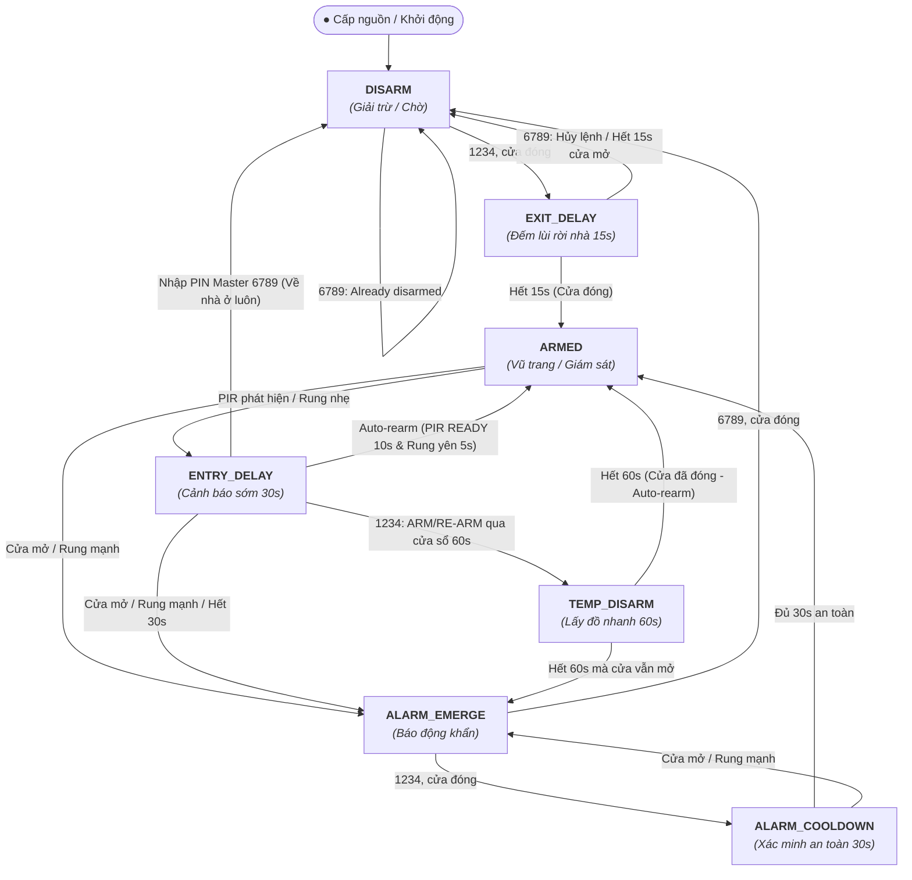

# HỆ THỐNG BÁO ĐỘNG XÂM NHẬP (INTRUSION ALARM SYSTEM)

### STM32F103C8T6 (ARM Cortex-M3 @ 72MHz)

Firmware báo động xâm nhập đa cảm biến sử dụng FSM 7 trạng thái, tích hợp KY-003 Mạch Cảm Biến Từ Trường (Hall Sensor), PIR HC-SR501, SW-420, keypad 4x4, OLED SH1106, còi PWM và nhật ký sự
kiện MicroSD có khả năng phục hồi sau khi tháo/lỗi thẻ.

> **Trạng thái dự án:** Nhánh `main` build thành công bằng CMake + Ninja + GNU
> Arm Embedded Toolchain và đã được verify trên STM32F103C8T6 qua ST-Link V2.
> Artifact chuẩn được sinh cục bộ trong `build/Debug/` và không lưu vào Git.

> **Tên đề tài tiếng Anh:** STM32F103 Intrusion Alarm System with Multi-Sensor FSM
>
> **Tên đề tài tiếng Việt:** Hệ thống Báo động Xâm nhập Đa cảm biến dùng FSM trên STM32F103
> **Nhóm sinh viên thực hiện (4 thành viên):**
>
> 1. **Nguyễn Lê Hữu Thoại** (2511006) - *Nhóm trưởng*: Thiết kế mô hình FSM, tích hợp hệ thống, xử lý I/O, viết tài liệu.
> 2. **Hàng Tuấn Bảo** (2510438): Khối cảm biến đầu vào (INPUT: KY-003 Mạch Cảm Biến Từ Trường, PIR, SW-420, mạch chống nhiễu, EXTI).
> 3. **Nguyễn Phước Thành** (2550517): Khối thiết bị đầu ra (OUTPUT: LED, Buzzer, OLED, Nguồn, Đi dây phần cứng).
> 4. **Nguyễn Đăng Khoa** (2551799): Phần mềm cốt lõi, Driver/Lib, Toolchain CMake + Ninja + ST-Link CLI, Log UART & Thẻ nhớ.

---

## 📑 MỤC LỤC

1. [Tổng Quan Dự Án](#1-tổng-quan-dự-án)
2. [Sơ Đồ Kết Nối Phần Cứng & Pinout STM32](#2-sơ-đồ-kết-nối-phần-cứng--pinout-stm32)
3. [Thiết Kế Máy Trạng Thái Hữu Hạn (7-State FSM)](#3-thiết-kế-máy-trạng-thái-hữu-hạn-7-state-fsm)
4. [Kịch Bản Kiểm Thử Hoạt Động (Test Cases TC01 - TC13)](#4-kịch-bản-kiểm-thử-hoạt-động-test-cases-tc01---tc13)
5. [Thuật Toán Xử Lý Tín Hiệu & Hiệu Chuẩn Cảm Biến](#5-thuật-toán-xử-lý-tín-hiệu--hiệu-chuẩn-cảm-biến)
6. [Cấu Trúc Thư Mục Dự Án](#6-cấu-trúc-thư-mục-dự-án)
7. [Hướng Dẫn Biên Dịch (Build) & Nạp Code (Flash)](#7-hướng-dẫn-biên-dịch-build--nạp-code-flash)
8. [Hướng Dẫn Đọc Log Debug Qua UART](#8-hướng-dẫn-đọc-log-debug-qua-uart)

---

## 1. TỔNG QUAN DỰ ÁN

Hệ thống Báo động Xâm nhập là một giải pháp an ninh nhúng thời gian thực (Real-time Embedded Security System) được xây dựng trên vi điều khiển STM32F103C8T6. Hệ thống tích hợp đa cảm biến đầu vào nhằm bảo vệ toàn diện ngôi nhà/văn phòng chống lại các hành vi đột nhập trái phép:

* **KY-003 Mạch Cảm Biến Từ Trường (Hall Effect Sensor):** Giám sát trạng thái đóng/mở của cửa ra vào tức thì qua ngắt EXTI bằng hiệu ứng Hall khi nam châm gắn trên cửa lại gần hoặc rời xa.
* **Cảm biến Rung (SW-420):** Thuật toán đếm xung trong cửa sổ trượt $1.0\text{s}$ để phân biệt rung nhẹ do gió/va quẹt với hành vi đập phá, dùng xà beng cạy cửa.
* **Cảm biến Thân nhiệt Chuyển động (PIR HC-SR501):** Phát hiện kẻ gian di chuyển trong vùng quét an ninh.
* **Bàn phím ma trận 4x4 (Keypad):** Nhập mã PIN bảo mật để Arm / Disarm / Bỏ qua cảnh báo.
* **Màn hình OLED SH1106 1.3 inch, 128x64 (I2C):** Địa chỉ 7-bit `0x3C` (`0x78` theo định dạng địa chỉ HAL), hiển thị trạng thái, đếm ngược, cấp độ rung và hướng dẫn người dùng.
* **Còi Báo động (Buzzer):** Phát âm thanh cảnh báo ngắt quãng hoặc còi hú khẩn cấp.
* **Thẻ nhớ MicroSD (SPI1 + FATFS):** Ghi nhật ký chi tiết mốc thời gian, loại cảm biến kích hoạt và sự kiện hệ thống.
* **Cổng Debug Serial (UART1):** Truyền log thời gian thực với tốc độ `115200 baud` lên máy tính.

Firmware khởi động ở `DISARM`, ưu tiên sự kiện cửa/rung trước xác thực PIN trong
các trạng thái bảo vệ, dùng watchdog để phục hồi vòng điều khiển bị treo và hiển
thị toàn bộ quá trình xác minh/báo động trên OLED 128x64. `ENTRY_DELAY` có timeout
tối đa 30 giây; cảnh báo sớm tự hủy khi PIR duy trì `READY` liên tục đủ 10 giây và cảm biến rung duy trì yên tĩnh đủ 5 giây, còn khi có chấn động rung hoặc cửa mở hệ thống sẽ phản ứng tức thì theo phân cấp an ninh.

Nhật ký SD dùng hàng đợi RAM 32 sự kiện. Mỗi record có số thứ tự tăng dần trong
phiên, timestamp `HAL_GetTick()` và snapshot cảm biến. Khi thẻ đang online,
logger ghi tối đa một record mỗi 100 ms bằng chuỗi `open → seek cuối file → write
→ f_sync → close`; chỉ khi `f_sync` thành công record mới được lấy khỏi queue.
Như vậy mọi chuyển trạng thái, kể cả `ALARM_EMERGE` và `ALARM_COOLDOWN`, đều được
đẩy xuống vật lý thay vì chờ hệ thống quay lại `DISARM`.

FatFs/SPI là giao tiếp đồng bộ nên một lần ghi vẫn có thể tạm dừng vòng lặp. Để
giới hạn ảnh hưởng khi tháo/lỗi thẻ, lần I/O hỏng đánh dấu logger offline ngay;
việc khởi tạo và mount lại mỗi 5 giây chỉ được phép trong `DISARM`, `EXIT_DELAY`
hoặc `TEMP_DISARM`, không lặp recovery trong `ENTRY_DELAY`, `ARMED`, báo động hay
cooldown. Sự kiện chưa ghi vẫn nằm trong queue; nếu queue đầy, `dropped_count` và
UART cho biết số sự kiện bị bỏ. Mỗi lần firmware khởi động, toàn bộ queue RAM,
chỉ số `head/tail/count` và `dropped_count` đều được xóa; logger không cấp phát heap.
File `LOG.TXT` không bị xóa: phiên mới được phân cách bằng `NEW BOOT SESSION` và
ghi nguyên nhân reset (`POWER_ON_RESET`, `RESET_PIN`, `SOFTWARE_RESET`,
`IWDG_TIMEOUT`...). Vì vậy timestamp quay lại từ 0 ms không bị nhầm với phiên trước.
Mọi chuyển trạng thái ghi kèm một snapshot nhất quán: `D` (cửa), `P` (PIR), `V`
(mức rung) và `E` (nguồn kích hoạt entry: PIR/rung). Log định kỳ/raw vẫn chỉ đi
UART để tránh làm đầy file và tăng số lần ghi thẻ. Logger cũng ghi sự kiện thẻ
offline/online và tổng số record đã phải bỏ khi queue từng bị đầy.

Independent watchdog dùng LSI, prescaler 256 và reload 4095, cho timeout danh định
khoảng 26,2 giây (thực tế phụ thuộc sai số LSI). Watchdog được bật trước khi dò
thẻ SD, được refresh trước các thao tác SD khởi động có giới hạn và ở cuối mỗi
vòng lặp. UART có timeout hữu hạn, OLED giới hạn 2 FPS; MCU sẽ reset nếu ngoại vi
làm vòng điều khiển treo quá lâu.

---

## 2. SƠ ĐỒ KẾT NỐI PHẦN CỨNG & PINOUT STM32

Toàn bộ sơ đồ chân được cấu hình chuẩn trên STM32F103C8T6:

| Khối Chức Năng                 | Linh Kiện                               | Chân STM32                                      | Chế Độ Cấu Hình (GPIO/Peripheral)                                                | Chức Năng Chi Tiết                                                                            |
| :-------------------------------- | :--------------------------------------- | :----------------------------------------------- | :------------------------------------------------------------------------------------ | :----------------------------------------------------------------------------------------------- |
| **Cảm Biến Cửa**         | KY-003 Mạch Cảm Biến Từ Trường (Hall Sensor) | **`PA0`**                                | `GPIO_EXTI0` (Pull-up, 2 sườn ngắt)                                              | Đóng cửa (có từ trường) = 0V (LOW), Mở cửa (mất từ trường) = 3.3V (HIGH)             |
| **Cảm Biến Thân Nhiệt** | Cảm biến chuyển động PIR (HC-SR501) | **`PA1`**                                | Pull-down;`.ioc` giữ `EXTI1` sườn lên, firmware lấy mẫu hai mức trong main | OUT mức HIGH khi phát hiện (VCC = 5V, jumper**H**)                                      |
| **Cảm Biến Rung**         | Module rung SW-420                       | **`PA2`**                                | `GPIO_EXTI2` (Pull-up, Sườn xuống)                                               | Thu thập xung rung chấn động đập/cạy cửa                                                 |
| **Thẻ Nhớ (CS)**          | Module MicroSD SPI                       | **`PA4`**                                | `GPIO_Output_PP`, không pull, mặc định HIGH                                     | Chip Select (CS) điều khiển giao tiếp thẻ nhớ                                              |
| **Thẻ Nhớ (SCK)**         | Module MicroSD SPI                       | **`PA5`**                                | `SPI1_SCK`, master                                                                  | Khoảng 281 kHz lúc khởi tạo; chuyển lên khoảng 9 MHz sau khi thẻ sẵn sàng              |
| **Thẻ Nhớ (MISO)**        | Module MicroSD SPI                       | **`PA6`**                                | `SPI1_MISO` (Master In Slave Out)                                                   | Dữ liệu từ thẻ SD gửi về STM32                                                             |
| **Thẻ Nhớ (MOSI)**        | Module MicroSD SPI                       | **`PA7`**                                | `SPI1_MOSI` (Master Out Slave In)                                                   | Dữ liệu từ STM32 ghi vào thẻ SD qua FATFS                                                   |
| **Còi Báo Động**        | Passive buzzer hoặc mạch driver còi   | **`PA8`**                                | `TIM1_CH1` PWM                                                                      | Điều khiển tiếng bíp phím và còi hú báo động                                         |
| **UART Debug (TX)**         | Mạch nạp ST-Link / USB-UART            | **`PA9`**                                | `USART1_TX` (115200 8N1)                                                            | Truyền log`printf` lên máy tính                                                            |
| **UART Debug (RX)**         | USB-UART                                 | **`PA10`**                               | `USART1_RX` (115200 8N1)                                                            | Đã cấu hình nhưng firmware hiện chưa xử lý lệnh UART                                   |
| **Bàn Phím (Hàng)**      | Keypad 4x4 (Row 1..4)                    | **`PB0, PB1, PB10, PB11`**               | `GPIO_Output_PP`, mặc định HIGH                                                  | Lần lượt kéo từng hàng xuống LOW để quét phím                                         |
| **Bàn Phím (Cột)**       | Keypad 4x4 (Col 1..4)                    | **`PB12, PB13, PB14, PB15`**             | `GPIO_Input` (Pull-up)                                                              | Đọc trạng thái cột để giải mã phím bấm                                                |
| **Màn Hình OLED**         | OLED 1.3" SH1106,`0x3C`/HAL `0x78`   | **`PB6`** (SCL), **`PB7`** (SDA) | `I2C1_SCL`, `I2C1_SDA` (100kHz)                                                   | Hiển thị giao diện UI đa màn hình                                                          |
| **LED Trạng Thái**        | LED onboard và LED ngoài tùy chọn    | **`PC13`**                               | `GPIO_Output_PP` (Active-Low)                                                       | LED ngoài:`3.3V -> 470Ω -> anode LED`, cathode LED `-> PC13`; nháy đồng bộ LED onboard |

Module MicroSD 6 chân dùng trong dự án được nối theo thứ tự chức năng:

```text
Module CS   -> PA4       Module SCK  -> PA5
Module MOSI -> PA7       Module MISO -> PA6
Module VCC  -> nguồn 5 V thật
Module GND  -> GND chung với STM32 và USB-UART
```

Module dạng Catalex có AMS1117-3.3 phải được cấp vào chân `VCC` bằng nguồn 5 V
đã đo xác nhận; không cấp 3.3 V qua AMS1117 và không dùng chân `5VIN` chưa xác
minh là ngõ ra. Chi tiết đo kiểm và chẩn đoán nằm trong [`moduleSD.md`](moduleSD.md).

Module KY-003 Mạch Cảm Biến Từ Trường gồm 3 chân kết nối: chân tín hiệu (S) nối vào `PA0` (`GPIO_EXTI0` cấu hình Pull-up nội), chân giữa (VCC) nối nguồn `3.3V` hoặc `5V`, và chân (-) nối `GND` chung STM32. Khi cửa đóng (nam châm gắn trên cánh cửa áp sát cảm biến Hall), chân S dẫn thông xuống GND kéo mức logic về LOW (0V). Khi cửa mở (nam châm tách xa cảm biến), chân S ngắt và được điện trở kéo lên mức HIGH (3.3V). Bộ lọc chống dội $50\text{ms}$ (`REED_DEBOUNCE_MS = 50`) loại trừ hoàn toàn các xung nhiễu cơ học/rung cánh cửa lúc chạm nam châm.

PA8 phát PWM 2 kHz, duty xấp xỉ 50% cho passive buzzer nhỏ hoặc tầng driver.
Keypad dùng beep 40 ms không blocking; beep bị vô hiệu trong `ENTRY_DELAY` và
`ALARM_EMERGE` để không can thiệp nhịp cảnh báo/còi hú. LED PC13
active-low được điều khiển theo pha thời gian của từng state; `TEMP_DISARM` dùng
hai chớp ngắn mỗi giây. `ALARM_EMERGE` giữ còi liên tục, còn `ALARM_COOLDOWN` đồng bộ
LED và buzzer theo nhịp giảm dần trong 30 giây.

---

## 3. THIẾT KẾ MÁY TRẠNG THÁI HỮU HẠN (7-STATE FSM)

Hệ thống gồm 7 trạng thái tách bạch và hai mã thể hiện trực tiếp ý định: `1234` là **ARM/RE-ARM**, còn `6789` là **MASTER DISARM**. Bàn phím chỉ được xử lý tại `DISARM`, `EXIT_DELAY`, `ENTRY_DELAY` và `ALARM_EMERGE`.



### Chi tiết các trạng thái & Cơ chế Dual-PIN:

* 🔒 **Mã `1234` — ARM/RE-ARM:** Bắt đầu ARM từ `DISARM`; khi đang xác minh hoặc báo động, mã này chọn đích cuối là `ARMED` thông qua `TEMP_DISARM` hoặc `ALARM_COOLDOWN`.
* 🔑 **Mã `6789` — MASTER DISARM:** Hủy `EXIT_DELAY` hoặc đưa hệ thống về `DISARM` từ `ENTRY_DELAY`/`ALARM_EMERGE` sau khi thỏa điều kiện cửa.

1. **`DISARM` (Giải trừ / Chờ):** Chỉ `1234#` với cửa đóng mới bắt đầu ARM. `6789#` hiển thị `ALREADY DISARMED`, không bị tính là PIN sai.
2. **`EXIT DELAY` (Đếm ngược rời nhà - 15s):** Màn hình đếm lùi 15s, còi bíp nhịp chậm nhắc nhở (100ms ON / 900ms OFF), LED nháy 1Hz. Người dùng có đủ thời gian bước ra ngoài và đóng cửa:
   * **Nhập `6789#`:** Hủy đếm lùi và quay về `DISARM`. `1234#` chỉ báo hệ thống đang thực hiện lệnh ARM.
   * **Hết 15s và Cửa ĐÃ ĐÓNG:** Hệ thống kích hoạt bảo vệ thành công $\rightarrow$ Chuyển sang **`ARMED`**.
   * **Hết 15s mà Cửa VẪN MỞ (quên đóng cửa):** Kích hoạt thất bại $\rightarrow$ Tự động chuyển về **`DISARM`** và hiển thị thông báo lỗi `ARM FAILED: Door Open!` (2.5s).
   * Trong suốt 15s đếm lùi `EXIT DELAY`, các tín hiệu PIR và rung được bỏ qua, người dùng mở cửa đi ra ngoài là hành vi hợp lệ.
3. **`ARMED` (Vũ trang / Giám sát toàn diện):** Hệ thống giám sát chặt chẽ:
   * Nếu PIR phát hiện chuyển động hoặc có rung nhẹ $\rightarrow$ Chuyển sang `ENTRY DELAY` để xác thực PIN trước khi báo động.
   * Nếu cửa mở hoặc có rung mạnh ($\ge 20$ xung) $\rightarrow$ Nhảy thẳng sang `ALARM EMERGE`.
   * Bàn phím bị bỏ qua hoàn toàn; muốn xác thực phải đi qua một sự kiện an ninh.
4. **`ENTRY DELAY` (Cảnh báo sớm - tối đa 30s):** PIR và rung nhẹ là hai cột xác minh độc lập. PIR phải duy trì `READY` liên tục 10s; rung phải không còn mức `LIGHT` liên tục 5s $\rightarrow$ Tự trở về `ARMED`. Cửa mở/rung mạnh chuyển ngay sang `ALARM EMERGE`.
   * **Nhập PIN `6789#` (Master):** Chuyển ngay về **`DISARM`** (về nhà ở luôn).
   * **Nhập PIN `1234#` (Temp):** Chuyển sang **`TEMP DISARM`** (60s lấy đồ nhanh).
5. **`TEMP DISARM` (Lấy đồ nhanh & Tạm giải trừ - 60s - Tự động 100%):** Bỏ qua hoàn toàn tín hiệu từ PIR, Rung và Bàn phím. Người dùng có 60 giây an toàn để bốc dỡ hàng hóa / lấy đồ:
   * **Giai đoạn 1 ($0\text{s} \to 45\text{s}$ - Yên tĩnh):** Còi tắt hoàn toàn, OLED hiển thị đếm lùi 60s và trạng thái cửa.
   * **Giai đoạn 2 ($45\text{s} \to 60\text{s}$ - Nhắc nhở 15 giây cuối):** Màn hình OLED chớp nháy cảnh báo `! PLEASE CLOSE DOOR !`; nếu cửa đang mở, còi phát tiếng bíp tăng dần tần số (Accelerating Beep: $500\text{ms} \to 250\text{ms} \to 100\text{ms}$).
   * **Chốt tự động ($t \ge 60\text{s}$):**
     * Nếu cửa **ĐÃ ĐÓNG** $\rightarrow$ Tự động chuyển về **`ARMED`** (Auto-rearm tiếp tục bảo vệ).
     * Nếu cửa **VẪN MỞ** $\rightarrow$ Kích hoạt còi hú **`ALARM EMERGE`** (quên đóng cửa khi đi ra ngoài).
6. **`ALARM EMERGE`:** Còi PWM hú liên tục và LED nháy nhanh. Khi cửa đóng, `1234#` chuyển sang `ALARM_COOLDOWN`; `6789#` giải trừ thẳng về `DISARM`. Khi cửa mở, cả hai mã đều bị từ chối.
7. **`ALARM COOLDOWN`:** Không nhận bàn phím. LED và buzzer chậm dần trong 30s. Cửa mở lại hoặc rung mạnh đưa hệ thống về `ALARM_EMERGE`; đủ 30s an toàn tự chuyển về `ARMED`.

### 3.2. Bảng Chân Trị Hợp Nhất 8 Tổ Hợp Cảm Biến Nhị Phân (Truth Table 2³ = 8)

Bảng chân trị chuẩn mô tả phản ứng của hệ thống đối với $2^3 = 8$ tổ hợp cảm biến nhị phân đầu vào: **Cửa ($D$)**, **PIR ($P$)**, **Rung ($V$)** trên từng trạng thái bảo vệ:

* **Quy ước mức logic:**
  * $D$ (Door - Cảm biến KY-003): `0` = Đóng (Nam châm áp sát KY-003), `1` = Mở (Nam châm rời xa KY-003)
  * $P$ (PIR): `0` = Yên tĩnh (OFF), `1` = Có thân nhiệt chuyển động (ACTIVE)
  * $V$ (Vibration): `0` = Yên tĩnh (`NONE`), `1` = Có rung chấn (`LIGHT` hoặc `HEAVY`)

|     STT     |      $D$      |      $P$      |      $V$      | Tình Trạng Cảm Biến Thực Tế       | Hành Vi Khi Đang `ARMED`                                                                                 | Hành Vi Khi `ENTRY_DELAY` (30s)                                                                          | Hành Vi Khi `TEMP_DISARM` (60s)              |
| :---------: | :-------------: | :-------------: | :-------------: | :-------------------------------- | :------------------------------------------------------------------------------------------------------- | :------------------------------------------------------------------------------------------------------- | :------------------------------------------- |
| **0**       | **`0`**         | **`0`**         | **`0`**         | Môi trường an toàn, tĩnh lặng     | Duy trì canh gác `ARMED`                                                                                 | Đếm lùi tự Re-arm (10s/5s) $\to$ `ARMED`                                                                 | Đếm lùi an toàn $\to$ `ARMED` (Auto-rearm)   |
| **1**       | **`0`**         | **`0`**         | **`1`**         | Cửa đóng, có chấn động rung      | Rung nhẹ $\to$ `ENTRY_DELAY`<br>Rung mạnh $\to$ `ALARM_EMERGE`                                           | Reset bộ đếm rung yên tĩnh<br>(Rung mạnh $\to$ `ALARM_EMERGE`)                                          | Bỏ qua rung (cho phép bốc hàng)              |
| **2**       | **`0`**         | **`1`**         | **`0`**         | Cửa đóng, phát hiện thân nhiệt   | Chuyển sang `ENTRY_DELAY` (xác minh)                                                                     | Reset bộ đếm PIR READY                                                                                   | Bỏ qua PIR (cho phép bốc hàng)               |
| **3**       | **`0`**         | **`1`**         | **`1`**         | Cửa đóng, vừa có người vừa rung | Chuyển sang `ENTRY_DELAY`<br>(Rung mạnh $\to$ `ALARM_EMERGE`)                                           | Reset cả 2 bộ đếm xác minh                                                                               | Bỏ qua (cho phép bốc hàng)                   |
| **4**       | **`1`**         | **`0`**         | **`0`**         | Cửa bị mở ra (đột nhập)           | Kích hoạt ngay **`ALARM_EMERGE`**                                                                        | Kích hoạt ngay **`ALARM_EMERGE`**                                                                        | Cảnh báo 15s cuối $\to$ Hết 60s `ALARM`      |
| **5**       | **`1`**         | **`0`**         | **`1`**         | Cửa mở + có rung                  | Kích hoạt ngay **`ALARM_EMERGE`**                                                                        | Kích hoạt ngay **`ALARM_EMERGE`**                                                                        | Cảnh báo 15s cuối $\to$ Hết 60s `ALARM`      |
| **6**       | **`1`**         | **`1`**         | **`0`**         | Cửa mở + có người bước vào      | Kích hoạt ngay **`ALARM_EMERGE`**                                                                        | Kích hoạt ngay **`ALARM_EMERGE`**                                                                        | Cảnh báo 15s cuối $\to$ Hết 60s `ALARM`      |
| **7**       | **`1`**         | **`1`**         | **`1`**         | Cửa mở + người + rung đập phá    | Kích hoạt ngay **`ALARM_EMERGE`**                                                                        | Kích hoạt ngay **`ALARM_EMERGE`**                                                                        | Cảnh báo 15s cuối $\to$ Hết 60s `ALARM`      |

#### Bảng Phản Ứng Tương Tác Bàn Phím (Mã PIN) & Timeout:

| Trạng Thái Hiện Tại                     | PIN ARM/RE-ARM (`1234#`)                                                                                     | PIN MASTER DISARM (`6789#`)                                                                                  | Khi Hết Thời Gian Timeout                                                            | Nhập Sai PIN     | Sau 5 Lần Nhập Sai                  |
| :------------------------------------------ | :----------------------------------------------------------------------------------------------------------- | :----------------------------------------------------------------------------------------------------------- | :----------------------------------------------------------------------------------- | :---------------- | :------------------------------------ |
| **`DISARM`**                        | Cửa đóng $\to$ `EXIT_DELAY`<br>Cửa mở $\to$ Từ chối ARM                                                    | Hiển thị `ALREADY DISARMED`, giữ nguyên state                                                                 | Không áp dụng                                                                         | Báo `WRONG PIN` | Khóa phím 30 giây (`PIN LOCKED`) |
| **`EXIT_DELAY`**                    | Báo `USE 6789 TO CANCEL`, tiếp tục đếm                                                                        | Hủy đếm lùi $\to$ `DISARM`                                                                                   | Cửa đóng $\to$ `ARMED`<br>Cửa mở $\to$ `DISARM`                                    | Báo `WRONG PIN` | Khóa phím 30 giây                  |
| **`ARMED`**                         | Bỏ qua bàn phím                                                                                               | Bỏ qua bàn phím                                                                                               | Không áp dụng                                                                         | Không áp dụng    | Không áp dụng                      |
| **`ENTRY_DELAY`**                   | Cửa đóng $\to$ Sang **`TEMP_DISARM` (60s)**                                                                  | Chuyển ngay về **`DISARM`** (Về nhà ở luôn)                                                                  | Hết 30s $\to$ Kích hoạt `ALARM_EMERGE`                                                | Báo `WRONG PIN` | Khóa phím 30 giây                  |
| **`TEMP_DISARM`**                   | Bỏ qua bàn phím (Tự động 100%)                                                                               | Bỏ qua bàn phím (Tự động 100%)                                                                               | Hết 60s & Cửa đóng $\to$ Về **`ARMED`**<br>Hết 60s & Cửa mở $\to$ Hú `ALARM_EMERGE`   | Không áp dụng     | Không áp dụng                         |
| **`ALARM_EMERGE`**                  | Cửa đóng $\to$ `ALARM_COOLDOWN`<br>Cửa mở $\to$ Từ chối (`CLOSE DOOR FIRST`)                               | Cửa đóng $\to$ `DISARM`<br>Cửa mở $\to$ Từ chối (`CLOSE DOOR FIRST`)                                       | Không timeout; hú còi đến khi xác thực                                                | Báo `WRONG PIN` | Khóa phím 30 giây (`PIN LOCKED`) |
| **`ALARM_COOLDOWN`**                | Bỏ qua bàn phím                                                                                               | Bỏ qua bàn phím                                                                                               | Hết 30s an toàn $\to$ `ARMED`; cửa mở/rung mạnh $\to$ `ALARM_EMERGE`                | Không áp dụng    | Không áp dụng                      |

---

### 3.3. Các Cửa Sổ Tương Quan Thời Gian (Time Windows & Filter Parameters)

| Hằng Số Định Nghĩa      | Giá Trị | Đơn Vị | Chức Năng Chi Tiết                                                                                          |
| :--------------------------- | :-------: | :-------: | :------------------------------------------------------------------------------------------------------------- |
| `REED_DEBOUNCE_MS`         |  `50`  |    ms    | Thời gian xác nhận tín hiệu cảm biến từ trường KY-003 ổn định sau ngắt `EXTI0`.                              |
| `VIB_GLITCH_FILTER_MS`     |   `8`   |    ms    | Bộ lọc chống dội lò xo cơ học ngắt `EXTI2` của module rung SW-420.                                           |
| `VIB_WINDOW_MS`            | `1000` |    ms    | Cửa sổ tích lũy xung rung (0-5: `NONE`, 6-19: `LIGHT`, $\ge 20$: `HEAVY`).                                   |
| `PIR_WARMUP_MS`            | `30000` |    ms    | Thời gian làm ấm mắt cảm biến PIR HC-SR501 sau khi cấp nguồn (30 giây).                                       |
| `PIR_STABLE_MS`            | `1400` |    ms    | Mức OUT của PIR phải giữ liên tục $\ge 1.4\text{s}$ mới xác nhận chuyển động thật.                          |
| `PIR_BLOCKING_MS`          | `1000` |    ms    | Thời gian giữ ON trong phần mềm sau khi OUT hạ LOW trước khi công bố READY (1.0 giây).                        |
| `EXIT_DELAY_MS`            | `15000` |    ms    | Thời gian đếm lùi rời nhà để người dùng bước ra ngoài và đóng cửa (15 giây).                                  |
| `ENTRY_DELAY_MS`           | `30000` |    ms    | Thời gian tối đa để xác thực PIN khi có cảnh báo sớm trước khi hú còi (30 giây).                               |
| `ENTRY_PIR_READY_REARM_MS` | `10000` |    ms    | Thời gian PIR phải duy trì READY liên tục để tự hủy cảnh báo giả (10 giây).                                   |
| `ENTRY_VIB_QUIET_REARM_MS` | `5000` |    ms    | Thời gian rung phải duy trì NONE liên tục để tự hủy cảnh báo giả (5 giây).                                    |
| `TEMP_DISARM_MS`           | `60000` |    ms    | Cửa sổ lấy đồ nhanh và tự động Re-arm về `ARMED` khi đóng cửa (60 giây).                                      |
| `TEMP_DISARM_WARN_MS`      | `45000` |    ms    | Mốc kích hoạt cảnh báo bíp tăng dần ($500\text{ms} \to 250\text{ms} \to 100\text{ms}$) ở 15s cuối.          |
| `ALARM_COOLDOWN_MS`        | `30000` |    ms    | Thời gian xác minh an toàn độc lập trong `ALARM_COOLDOWN` (30 giây).                                          |
| `PIN_LOCKOUT_MS`           | `30000` |    ms    | Thời gian vô hiệu hóa bàn phím sau 5 lần nhập sai mã PIN liên tiếp (30 giây).                                  |

---

## 4. KỊCH BẢN KIỂM THỬ HOẠT ĐỘNG (TEST CASES TC01 - TC13)

| Mã Test       | Trạng Thái Bắt Đầu        | Sự Kiện Kích Hoạt                                                     | Kết Quả Mong Đợi / Chuyển Trạng Thái                                                                                                                                                                                                                                                                                                                           |
| :------------- | :----------------------------- | :------------------------------------------------------------------------ | :-------------------------------------------------------------------------------------------------------------------------------------------------------------------------------------------------------------------------------------------------------------------------------------------------------------------------------------------------------------------- |
| **TC01** | `DISARM`                     | Nhập `1234#` khi cửa đóng                                          | Vào `EXIT DELAY` (15s) $\rightarrow$ Hết 15s & Cửa đóng $\rightarrow$ Chuyển sang **`ARMED`**.                                                                                                                                                                                                                                                     |
| **TC02** | `DISARM`                     | Nhập `1234#` khi cửa mở / nhập `6789#`                             | Cửa mở: từ chối ARM. `6789#`: giữ **`DISARM`** và báo `ALREADY DISARMED`.                                                                                                                                                                                                                                                                              |
| **TC03** | `EXIT DELAY`                 | Nhập `6789#` / nhập `1234#`                                             | `6789#` hủy ngay về **`DISARM`**; `1234#` chỉ báo `USE 6789 TO CANCEL` và tiếp tục đếm.                                                                                                                                                                                                                                                                 |
| **TC03b** | `EXIT DELAY`                 | Hết 15s mà cửa vẫn còn mở (quên đóng cửa)                                 | Hủy kích hoạt bảo vệ $\rightarrow$ Báo lỗi `ARM FAILED: Door Open!` và tự trở về **`DISARM`**.                                                                                                                                                                                                                                                      |
| **TC04** | `ARMED`                      | PIR hoặc rung nhẹ                                                       | Chuyển sang **`ENTRY_DELAY`** 30s. Cửa mở hoặc rung mạnh chuyển ngay sang `ALARM_EMERGE`.                                                                                                                                                                                                                                                                    |
| **TC05a** | `ENTRY DELAY`                | Nhập mã Temp PIN **`1234#`** trước 30s                                  | Chuyển sang **`TEMP DISARM`** (60s) để lấy đồ nhanh.                                                                                                                                                                                                                                                                                                 |
| **TC05b** | `ENTRY DELAY`                | Nhập mã Master PIN **`6789#`** trước 30s                                | Giải trừ an ninh hoàn toàn $\rightarrow$ Chuyển về **`DISARM`**.                                                                                                                                                                                                                                                                                      |
| **TC06** | `ENTRY DELAY`                | Hết 30s mà chưa nhập đúng PIN                                       | Kích hoạt tức thì **`ALARM EMERGE`**; sự kiện được enqueue và, nếu thẻ đang online, ghi vật lý bằng `f_sync`.                                                                                                                                                                                                                                         |
| **TC07** | `ENTRY DELAY`                | Cửa mở hoặc rung mạnh                                                  | Chuyển thẳng sang **`ALARM EMERGE`** ngay lập tức.                                                                                                                                                                                                                                                                                                    |
| **TC08** | `TEMP DISARM`                | Hết 60s và Cửa đã đóng                                             | Tự động kích hoạt lại an ninh về **`ARMED`** (Auto-rearm).                                                                                                                                                                                                                                                                                             |
| **TC09** | `TEMP DISARM`                | Hết 60s mà Cửa vẫn còn mở (quên đóng cửa)                       | Kích hoạt tức thì **`ALARM EMERGE`**, còi hú báo quên đóng cửa.                                                                                                                                                                                                                                                                                        |
| **TC10** | `ALARM EMERGE`                | Đóng cửa rồi nhập `1234#` / `6789#`                               | `1234#` $\rightarrow$ **`ALARM_COOLDOWN`**; `6789#` $\rightarrow$ **`DISARM`**. Cửa mở thì cả hai mã đều bị từ chối.                                                                                                                                                                                                                                  |
| **TC10b** | `ALARM_COOLDOWN`             | Chờ đủ 30s / mở cửa hoặc rung mạnh                                | Đủ 30s an toàn $\rightarrow$ **`ARMED`**; cửa mở hoặc rung mạnh $\rightarrow$ **`ALARM_EMERGE`**. Bàn phím bị bỏ qua.                                                                                                                                                                                                                                  |
| **TC11** | `ENTRY DELAY`                | PIR `READY` liên tục 10s và rung yên liên tục 5s, cửa vẫn đóng | Hủy cảnh báo giả và tự trở lại **`ARMED`**. PIR hoặc rung nhẹ tái xuất hiện chỉ reset bộ đếm của cột tương ứng.                                                                                                                                                                                                                                |
| **TC12** | State có nhận PIN            | Nhập sai mã PIN 5 lần liên tiếp                                          | Khóa bàn phím 30 giây (`PIN LOCKED 30s`); cảm biến và timeout vẫn hoạt động. Phím trong `ARMED`, `TEMP_DISARM`, `ALARM_COOLDOWN` bị bỏ qua và không tăng bộ đếm.                                                                                                                                                                                        |

---

## 5. THUẬT TOÁN XỬ LÝ TÍN HIỆU & HIỆU CHUẨN CẢM BIẾN

### 5.1. Cảm Biến Rung SW-420 (Module `sensors.c` & `sensors.h`)

* **Bộ lọc chống dội cơ khí (Glitch Filter):** Ngắt `EXTI2` áp dụng bộ lọc $8\text{ms}$ (`VIB_GLITCH_FILTER_MS = 8`) để loại bỏ hoàn toàn hiện tượng rung lò xo nội tại.
* **Cửa sổ trượt thời gian 1.0 giây (`VIB_WINDOW_MS = 1000`):** Đếm tổng số xung tích lũy trong 1 giây để phân loại:
  * **$0 - 5$ xung:** Nhiễu nền môi trường $\rightarrow$ Bỏ qua (`VIB_NONE`).
  * **$6 - 19$ xung:** Rung nhẹ do va quẹt, gõ cửa $\rightarrow$ **`VIB_LIGHT`**.
  * **$\ge 20$ xung:** Chấn động đập phá, dùng búa/xà beng cạy cửa $\rightarrow$ **`VIB_HEAVY`**.
* **Quy trình Hiệu chuẩn (Calibration):**
  1. Mở `Core/Inc/sensors.h`, đặt `#define CALIBRATION_MODE 1`.
  2. Nạp code và mở UART Terminal (`115200 baud`).
  3. Thử nghiệm các kịch bản: (1) Môi trường tĩnh $\rightarrow$ (2) Gõ cửa nhẹ $\rightarrow$ (3) Đập mạnh cạy cửa.
  4. Cập nhật các giá trị xung thu thập được vào `VIB_NOISE_MAX`, `VIB_LIGHT_MIN`, `VIB_HEAVY_MIN`.
  5. Đặt lại `#define CALIBRATION_MODE 0` và nạp bản chạy thực tế.

### 5.2. KY-003 Mạch Cảm Biến Từ Trường (Hall Sensor) & Logic Ghép Nối (Coupling Logic)

* **Nguyên lý hoạt động cảm biến Hall KY-003:** Module sử dụng cảm biến từ trường Hall IC 3144 nhận diện từ tính của nam châm vĩnh cửu gắn trên cửa.
  * **Khi cửa đóng:** Nam châm áp sát cảm biến Hall $\rightarrow$ Transistor bên trong dẫn bão hòa $\rightarrow$ Kéo chân tín hiệu `S` xuống mức **LOW (0V)**.
  * **Khi cửa mở:** Nam châm rời xa cảm biến $\rightarrow$ Transistor ngắt $\rightarrow$ Điện trở kéo lên nội của STM32 giữ chân tín hiệu `S` ở mức **HIGH (3.3V)**.
* **Xử lý ngắt & Chống dội:** Ngắt `EXTI0` cấu hình bắt cả hai sườn (`GPIO_MODE_IT_RISING_FALLING`). Khi có ngắt, phần mềm áp dụng bộ đếm thời gian chống dội $50\text{ms}$ (`REED_DEBOUNCE_MS = 50`) để xác nhận tín hiệu đã đạt trạng thái ổn định trước khi cập nhật vào FSM, loại trừ các dao động cơ học khi cánh cửa sập mạnh.
* **Logic thông minh kết hợp (Coupling Logic):**
  * **Cửa Đóng (`Door == 0`):** Tự động gọi `Vibration_Reset()` xóa sạch xung chấn động sinh ra lúc sập cửa $\rightarrow$ Bật chế độ giám sát rung.
  * **Cửa Mở (`Door == 1`):** Tạm thời ngắt phân tích rung để tránh hiện tượng gió lùa làm rung lắc cánh cửa mở gây báo động rung giả.

### 5.3. Cảm Biến Chuyển Động Thân Nhiệt PIR (HC-SR501)

* **Thời gian warm-up 30s:** Trong 30 giây đầu tiên (`PIR_WARMUP_MS = 30000`), tín hiệu PIR chưa được đưa vào FSM.
* **Lọc mức OUT (1.4s):** Firmware lấy mẫu cả HIGH và LOW; một mức chỉ được chấp nhận sau khi ổn định liên tục $1400\text{ms}$ (`PIR_STABLE_MS = 1400`), loại bỏ hoàn toàn các xung gai điện hoặc rung động nhỏ ngẫu nhiên.
* **Bám blocking time (1.0s):** Khi OUT xuống LOW, trạng thái PIR duy trì ON thêm $1.0\text{s}$ (`PIR_BLOCKING_MS = 1000`) trước khi công bố OFF / READY, giúp giải phóng trạng thái kịp thời.
* **UART chẩn đoán 1 Hz:** Không in log PIR định kỳ trong warm-up. Sau khi warm-up hoàn tất, mỗi giây in `raw`, `filtered` và `phase` (`READY`, `ACTIVE`, `BLOCKING`) để phân biệt xung vật lý của module với tín hiệu đã đưa vào FSM.
* **Cấu hình phần cứng bắt buộc:**
  * Cắm Jumper trên module sang vị trí **`H`** (Repeatable Trigger) để tín hiệu OUT giữ mức HIGH liên tục khi có người di chuyển.
  * Cấp nguồn VCC vào chân **`5V`** (không cắm 3.3V vì sẽ gây sụt áp IC ổn áp 7133).
  * Bắt đầu với *Sensitivity* gần `MIN`, sau đó tăng từng bước nhỏ đến vùng quét cần thiết; không suy đoán chiều xoay nếu PCB không in `MIN/MAX` vì có nhiều phiên bản module.
  * Chỉnh *Time Delay* về gần `MIN` để OUT hạ LOW nhanh sau 2–3 giây khi hết chuyển động.
* **Giới hạn hiện tại:** Bộ lọc 1400 ms loại các xung HIGH quá ngắn dưới 1.4 giây. Nếu UART thỉnh thoảng hiện `raw=HIGH` nhưng `filtered=OFF`, đó là xung chưa đủ thời gian xác nhận, không phải FSM tự đảo trạng thái.

---

## 6. CẤU TRÚC THƯ MỤC DỰ ÁN

```text
Intrusion-Alarm-System/
├── CMakeLists.txt              # Cấu hình hệ thống biên dịch CMake
├── CMakePresets.json           # Thiết lập toolchain & preset build
├── Prj2008.ioc                 # File cấu hình đồ họa STM32CubeMX
├── STM32F103xx_FLASH.ld        # Linker script định vị bộ nhớ Flash/RAM
├── startup_stm32f103xb.s       # File khởi động Assembly của vi điều khiển
├── build_and_flash.bat         # Script tự động build & flash nhanh trên Windows
├── .gitignore                  # Bộ lọc loại bỏ file build trung gian
├── .gitattributes              # Chuẩn hóa LF/CRLF và nhận diện file binary
├── README.md                   # Tài liệu toàn diện của dự án
├── moduleSD.md                 # Tài liệu nghiên cứu & đo kiểm module MicroSD SPI
├── Core/
│   ├── Inc/                    # Các file Header khai báo (.h)
│   │   ├── main.h              # Định nghĩa chân I/O và nguyên mẫu hàm
│   │   ├── fsm.h               # Header Máy trạng thái FSM & Dual-PIN
│   │   ├── sensors.h           # Header driver phân loại rung & cảm biến
│   │   ├── time_utils.h        # So sánh tick/deadline an toàn khi uint32_t tràn
│   │   ├── keypad.h            # Header driver bàn phím ma trận 4x4
│   │   ├── ssd1306.h           # Header driver OLED SH1106 / SSD1306
│   │   ├── fonts.h             # Header phông chữ ma trận (Font 7x10, 11x18)
│   │   ├── gpio.h, usart.h...  # Khai báo cấu hình ngoại vi HAL
│   ├── Src/                    # Các file mã nguồn thực thi (.c)
│   │   ├── main.c              # Chương trình chính & Vòng lặp tác vụ
│   │   ├── fsm.c               # Hiện thực 6-State FSM, Buzzer PWM & OLED UI
│   │   ├── sensors.c           # Hiện thực xử lý xung rung & lọc nhiễu
│   │   ├── sd_spi.c            # Driver block MicroSD SPI và đọc CSD
│   │   ├── sd_logger.c         # Queue nhật ký, ghi FatFs và phục hồi thẻ
│   │   ├── keypad.c            # Quét ma trận phím Non-blocking
│   │   ├── ssd1306.c           # Điều khiển hiển thị OLED qua I2C
│   │   ├── fonts.c             # Bitmap font chữ ma trận
│   │   ├── gpio.c              # Cấu hình ngắt EXTI & chân I/O
│   │   ├── usart.c, spi.c...   # Khởi tạo phần cứng UART, SPI, Timer
├── FATFS/                      # Thư viện quản lý tệp FAT32 trên Thẻ nhớ SD
│   ├── App/fatfs.c
│   └── Target/user_diskio.c
├── Drivers/                    # Thư viện STM32F1xx HAL Driver & CMSIS
└── Middlewares/                # Mã nguồn FatFs Middleware
```

---

## 7. HƯỚNG DẪN BIÊN DỊCH (BUILD) & NẠP CODE (FLASH)

### Cách 1: Sử Dụng Script Tự Động (`build_and_flash.bat`)

Yêu cầu máy Windows đã cài và đưa vào `PATH`: CMake, Ninja, GNU Arm Embedded Toolchain. STM32CubeProgrammer CLI có thể nằm trong `PATH` hoặc thư mục cài đặt mặc định dưới `Program Files`.

Chạy script bằng cách nhấp đúp hoặc từ Windows Terminal:

```cmd
build_and_flash.bat
```

Script sẽ:

1. Chuyển về đúng thư mục dự án và kiểm tra toolchain.
2. Cấu hình/build preset `Debug` tại `build\Debug`.
3. Sinh đồng thời `Prj2008.elf`, `Prj2008.hex`, `Prj2008.bin` và `Prj2008.map` sau mỗi lần link.
4. Liệt kê ST-Link và hỏi serial trước khi nạp. Chỉ để trống khi máy có đúng một probe.
5. Nạp `build\Debug\Prj2008.elf`, verify và reset MCU.

Có thể truyền serial của probe cần dùng qua tham số đầu tiên hoặc biến môi trường; serial không được lưu trong repository:

```cmd
build_and_flash.bat YOUR_STLINK_SERIAL
```

```cmd
set STLINK_SN=YOUR_STLINK_SERIAL
build_and_flash.bat
```

### Cách 2: Sử Dụng Lệnh CMake & Ninja Thủ Công

1. **Cấu hình preset Debug:**
   ```cmd
   cmake --preset Debug
   ```
2. **Biên dịch mã nguồn (Build):**
   ```cmd
   cmake --build --preset Debug
   ```
3. **Liệt kê probe và nạp đúng ST-Link:**
   ```cmd
   STM32_Programmer_CLI.exe -l stlink
   STM32_Programmer_CLI.exe -c port=SWD sn=YOUR_STLINK_SERIAL freq=100 -w build\Debug\Prj2008.elf -v -rst
   ```

Không nạp một file HEX/ELF cũ từ layout `build\` cấp trên. Artifact chuẩn của dự án luôn nằm trong `build\Debug\` (hoặc `build\Release\` khi chủ động dùng preset Release).

Lệnh build chỉ tạo firmware; thao tác flash luôn cần chọn đúng probe từ kết quả
`STM32_Programmer_CLI.exe -l stlink`. Repository không chứa serial ST-Link hoặc
đường dẫn riêng của bất kỳ thành viên nào.

---

## 8. HƯỚNG DẪN ĐỌC LOG DEBUG QUA UART

1. Cắm USB-to-UART vào máy tính:
   * Chân **`PA9`** (TX) của STM32 nối vào chân **`RX`** của mạch USB-to-UART.
   * Chân **`GND`** nối chung với GND máy tính.
2. Mở phần mềm Serial Monitor (PuTTY, Hercules, TeraTerm, hoặc Serial Monitor trên VS Code / STM32CubeIDE).
3. Thiết lập thông số kết nối:
   * **Baudrate:** `115200`
   * **Data bits:** `8`
   * **Parity:** `None`
   * **Stop bit:** `1`
   * **Flow Control:** `None`
4. Bạn sẽ nhận được các thông điệp hệ thống thời gian thực theo định dạng:
   ```text
   ========================================
     INTRUSION ALARM SYSTEM - STM32F103
     Firmware Ver 2.3 (7-State Dual-PIN + Durable Log)
     PIR Warm-up Time: 30 seconds...
   ========================================
   [KEYPAD] Pressed: 1
   [SENSOR] KY-003: Door CLOSED. Vibration monitoring active.
   [SENSOR] PIR: Warm-up Complete (30s). Motion monitoring ACTIVE!
   [12079ms] VIB window=8 level=LIGHT
   [14079ms] VIB window=23 level=HEAVY
   [SENSOR] PIR: Motion DETECTED!
   [PIR] raw=HIGH filtered=ON phase=ACTIVE
   [PIR] raw=LOW filtered=ON phase=BLOCKING
   [PIR] raw=LOW filtered=OFF phase=READY
   ```

Trong warm-up không có dòng trạng thái PIR định kỳ. Sau đó, `READY` là đang chờ; `ACTIVE` là đã xác nhận chuyển động; `BLOCKING` là chân OUT đã LOW nhưng trạng thái lọc vẫn ON trong 1,0 giây. Không mở đồng thời COM bằng hai phần mềm vì một ứng dụng sẽ giữ độc quyền cổng UART.

File `LOG.TXT` trên thẻ dùng định dạng sau; `seq` giúp nhận biết record trùng nếu
thẻ lỗi đúng lúc `f_sync/close` khiến firmware phải thử ghi lại:

```text
[#000001][412ms] ========== NEW BOOT SESSION ==========
[#000002][412ms] BOOT reset_cause=POWER_ON_RESET
[#000003][412ms] FW version=2.3 fsm=7-state dual-pin log=physical-sync
[#000004][413ms] SD_INIT status=ONLINE
[#000005][1418ms] FSM Initialized: STATE_DISARM | D=CLOSED P=WARMUP V=NONE E=NONE
```
