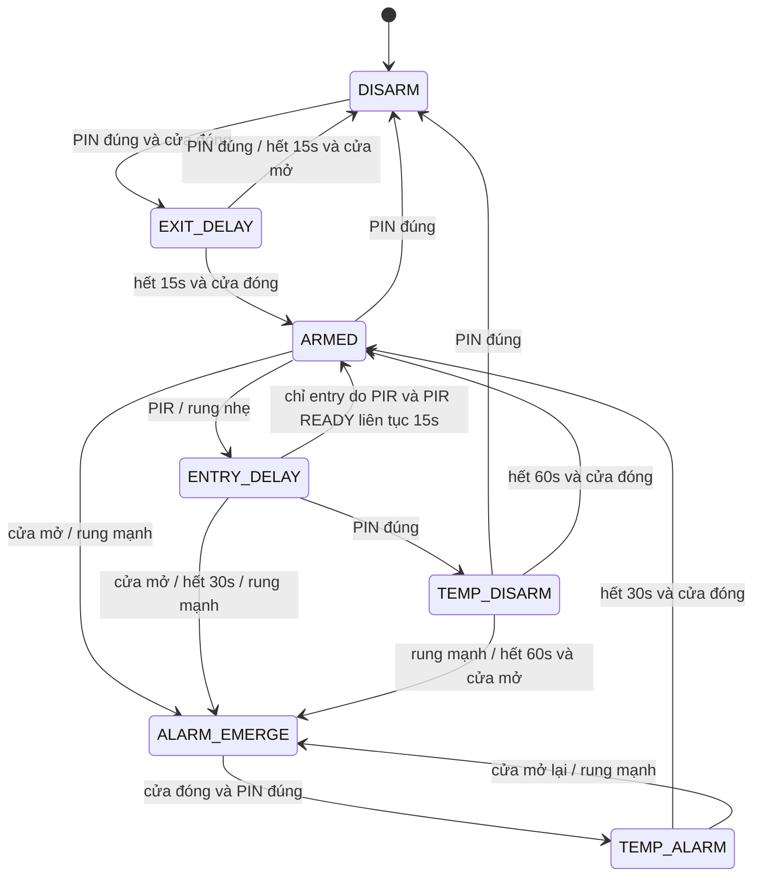

# HỆ THỐNG BÁO ĐỘNG XÂM NHẬP (INTRUSION ALARM SYSTEM)
### STM32F103C8T6 (ARM Cortex-M3 @ 72MHz)

Firmware báo động xâm nhập đa cảm biến sử dụng FSM 7 trạng thái, tích hợp Reed
Switch, PIR HC-SR501, SW-420, keypad 4x4, OLED SH1106, còi PWM và nhật ký sự
kiện MicroSD có khả năng phục hồi sau khi tháo/lỗi thẻ.

> **Trạng thái dự án:** Nhánh `main` build thành công bằng CMake + Ninja + GNU
> Arm Embedded Toolchain và đã được verify trên STM32F103C8T6 qua ST-Link V2.
> Artifact chuẩn được sinh cục bộ trong `build/Debug/` và không lưu vào Git.

> **Tên đề tài tiếng Anh:** STM32F103 Intrusion Alarm System with Multi-Sensor FSM
>
> **Tên đề tài tiếng Việt:** Hệ thống Báo động Xâm nhập Đa cảm biến dùng FSM trên STM32F103
> **Nhóm sinh viên thực hiện (4 thành viên):**
> 1. **Nguyễn Lê Hữu Thoại** (2511006) - *Nhóm trưởng*: Thiết kế mô hình FSM, tích hợp hệ thống, xử lý I/O, viết tài liệu.
> 2. **Hàng Tuấn Bảo** (2510438): Khối cảm biến đầu vào (INPUT: Reed, PIR, SW-420, mạch chống nhiễu, EXTI).
> 3. **Nguyễn Phước Thành** (2550517): Khối thiết bị đầu ra (OUTPUT: LED, Buzzer, OLED, Nguồn, Đi dây phần cứng).
> 4. **Nguyễn Đăng Khoa** (2551799): Phần mềm cốt lõi, Driver/Lib, Toolchain CMake + Ninja + ST-Link CLI, Log UART & Thẻ nhớ.

---

## 📑 MỤC LỤC
1. [Tổng Quan Dự Án](#1-tổng-quan-dự-án)
2. [Sơ Đồ Kết Nối Phần Cứng & Pinout STM32](#2-sơ-đồ-kết-nối-phần-cứng--pinout-stm32)
3. [Thiết Kế Máy Trạng Thái Hữu Hạn (7-State FSM)](#3-thiết-kế-máy-trạng-thái-hữu-hạn-7-state-fsm)
4. [Kịch Bản Kiểm Thử Hoạt Động (Test Cases TC01 - TC11)](#4-kịch-bản-kiểm-thử-hoạt-động-test-cases-tc01---tc11)
5. [Thuật Toán Xử Lý Tín Hiệu & Hiệu Chuẩn Cảm Biến](#5-thuật-toán-xử-lý-tín-hiệu--hiệu-chuẩn-cảm-biến)
6. [Cấu Trúc Thư Mục Dự Án](#6-cấu-trúc-thư-mục-dự-án)
7. [Hướng Dẫn Biên Dịch (Build) & Nạp Code (Flash)](#7-hướng-dẫn-biên-dịch-build--nạp-code-flash)
8. [Hướng Dẫn Đọc Log Debug Qua UART](#8-hướng-dẫn-đọc-log-debug-qua-uart)

---

## 1. TỔNG QUAN DỰ ÁN

Hệ thống Báo động Xâm nhập là một giải pháp an ninh nhúng thời gian thực (Real-time Embedded Security System) được xây dựng trên vi điều khiển STM32F103C8T6. Hệ thống tích hợp đa cảm biến đầu vào nhằm bảo vệ toàn diện ngôi nhà/văn phòng chống lại các hành vi đột nhập trái phép:

* **Công tắc từ cửa (Reed Switch):** Giám sát trạng thái đóng/mở của cửa ra vào tức thì qua ngắt EXTI.
* **Cảm biến Rung (SW-420):** Thuật toán đếm xung trong cửa sổ trượt $1.0\text{s}$ để phân biệt rung nhẹ do gió/va quẹt với hành vi đập phá, dùng xà beng cạy cửa.
* **Cảm biến Thân nhiệt Chuyển động (PIR HC-SR501):** Phát hiện kẻ gian di chuyển trong vùng quét an ninh.
* **Bàn phím ma trận 4x4 (Keypad):** Nhập mã PIN bảo mật để Arm / Disarm / Bỏ qua cảnh báo.
* **Màn hình OLED SH1106 1.3 inch, 128x64 (I2C):** Địa chỉ 7-bit `0x3C` (`0x78` theo định dạng địa chỉ HAL), hiển thị trạng thái, đếm ngược, cấp độ rung và hướng dẫn người dùng.
* **Còi Báo động (Buzzer):** Phát âm thanh cảnh báo ngắt quãng hoặc còi hú khẩn cấp.
* **Thẻ nhớ MicroSD (SPI1 + FATFS):** Ghi nhật ký chi tiết mốc thời gian, loại cảm biến kích hoạt và sự kiện hệ thống.
* **Cổng Debug Serial (UART1):** Truyền log thời gian thực với tốc độ `115200 baud` lên máy tính.

Firmware khởi động ở `DISARM`, ưu tiên sự kiện cửa/rung trước xác thực PIN trong
các trạng thái bảo vệ, dùng watchdog để phục hồi vòng điều khiển bị treo và hiển
thị toàn bộ quá trình xác minh/báo động trên OLED 128x64. `ENTRY_DELAY` có timeout
tối đa 30 giây; chỉ cảnh báo do PIR mới được tự hủy khi PIR duy trì `READY` đủ
15 giây, còn cảnh báo do rung được xử lý độc lập.

Nhật ký SD dùng hàng đợi RAM 16 sự kiện: FSM chỉ enqueue, không gọi FatFs/SPI khi
đang `EXIT_DELAY`, `ARMED`, `ENTRY_DELAY` hoặc còi hú `ALARM_EMERGE`.
`sd_logger.c` chỉ ghi và `f_sync` trong các cửa sổ an toàn `DISARM` và
`TEMP_DISARM`, tối đa một bản ghi mỗi 250 ms. Vì vậy không truy cập thẻ khi đang
canh gác, xác minh xâm nhập hoặc trong cả hai trạng thái còi hú. Khi I/O lỗi,
sự kiện chưa ghi được giữ lại, thẻ được đánh dấu offline và chỉ thử khởi tạo/mount
lại mỗi 5 giây trong trạng thái an toàn; nếu queue đầy, bộ đếm `dropped_count` và
UART cho biết số sự kiện bị bỏ. Mỗi lần firmware khởi động, toàn bộ queue RAM,
chỉ số `head/tail/count` và `dropped_count` đều được xóa; logger không cấp phát heap.
File `LOG.TXT` không bị xóa: phiên mới được phân cách bằng `NEW BOOT SESSION` và
ghi nguyên nhân reset (`POWER_ON_RESET`, `RESET_PIN`, `SOFTWARE_RESET`,
`IWDG_TIMEOUT`...). Vì vậy timestamp quay lại từ 0 ms không bị nhầm với phiên trước.
Mọi chuyển trạng thái ghi kèm một snapshot nhất quán: `D` (cửa), `P` (PIR), `V`
(mức rung) và `E` (nguồn kích hoạt entry: PIR/rung). Log định kỳ/raw vẫn chỉ đi
UART để tránh làm đầy file và tăng số lần ghi thẻ. Logger cũng ghi sự kiện thẻ
offline/online và tổng số record đã phải bỏ khi queue từng bị đầy.

Independent watchdog dùng LSI với timeout danh định khoảng 20 giây và được feed
ở cuối vòng lặp. UART có timeout truyền hữu hạn, OLED được giới hạn 2 FPS để giảm
blocking; watchdog sẽ reset MCU nếu một ngoại vi vẫn làm vòng điều khiển treo lâu.

---

## 2. SƠ ĐỒ KẾT NỐI PHẦN CỨNG & PINOUT STM32

Toàn bộ sơ đồ chân được cấu hình chuẩn trên STM32F103C8T6:

| Khối Chức Năng | Linh Kiện | Chân STM32 | Chế Độ Cấu Hình (GPIO/Peripheral) | Chức Năng Chi Tiết |
| :--- | :--- | :--- | :--- | :--- |
| **Cảm Biến Cửa** | Công tắc từ (MC-38 / Reed Switch) | **`PA0`** | `GPIO_EXTI0` (Pull-up, 2 sườn ngắt) | Đóng cửa = 0V, Mở cửa = 3.3V (Ngắt kích hoạt tức thì) |
| **Cảm Biến Thân Nhiệt** | Cảm biến chuyển động PIR (HC-SR501) | **`PA1`** | Pull-down; `.ioc` giữ `EXTI1` sườn lên, firmware lấy mẫu hai mức trong main | OUT mức HIGH khi phát hiện (VCC = 5V, jumper **H**) |
| **Cảm Biến Rung** | Module rung SW-420 | **`PA2`** | `GPIO_EXTI2` (Pull-up, Sườn xuống) | Thu thập xung rung chấn động đập/cạy cửa |
| **Thẻ Nhớ (CS)** | Module MicroSD SPI | **`PA4`** | `GPIO_Output_PP`, không pull, mặc định HIGH | Chip Select (CS) điều khiển giao tiếp thẻ nhớ |
| **Thẻ Nhớ (SCK)** | Module MicroSD SPI | **`PA5`** | `SPI1_SCK`, master | Khoảng 281 kHz lúc khởi tạo; chuyển lên khoảng 9 MHz sau khi thẻ sẵn sàng |
| **Thẻ Nhớ (MISO)** | Module MicroSD SPI | **`PA6`** | `SPI1_MISO` (Master In Slave Out) | Dữ liệu từ thẻ SD gửi về STM32 |
| **Thẻ Nhớ (MOSI)** | Module MicroSD SPI | **`PA7`** | `SPI1_MOSI` (Master Out Slave In) | Dữ liệu từ STM32 ghi vào thẻ SD qua FATFS |
| **Còi Báo Động** | Passive buzzer hoặc mạch driver còi | **`PA8`** | `TIM1_CH1` PWM | Điều khiển tiếng bíp phím và còi hú báo động |
| **UART Debug (TX)**| Mạch nạp ST-Link / USB-UART | **`PA9`** | `USART1_TX` (115200 8N1) | Truyền log `printf` lên máy tính |
| **UART Debug (RX)**| USB-UART | **`PA10`** | `USART1_RX` (115200 8N1) | Đã cấu hình nhưng firmware hiện chưa xử lý lệnh UART |
| **Bàn Phím (Hàng)** | Keypad 4x4 (Row 1..4) | **`PB0, PB1, PB10, PB11`** | `GPIO_Output_PP`, mặc định HIGH | Lần lượt kéo từng hàng xuống LOW để quét phím |
| **Bàn Phím (Cột)** | Keypad 4x4 (Col 1..4) | **`PB12, PB13, PB14, PB15`** | `GPIO_Input` (Pull-up) | Đọc trạng thái cột để giải mã phím bấm |
| **Màn Hình OLED** | OLED 1.3" SH1106, `0x3C`/HAL `0x78` | **`PB6`** (SCL), **`PB7`** (SDA) | `I2C1_SCL`, `I2C1_SDA` (100kHz) | Hiển thị giao diện UI đa màn hình |
| **LED Trạng Thái** | LED onboard và LED ngoài tùy chọn | **`PC13`** | `GPIO_Output_PP` (Active-Low) | LED ngoài: `3.3V -> 470Ω -> anode LED`, cathode LED `-> PC13`; nháy đồng bộ LED onboard |

Module MicroSD 6 chân dùng trong dự án được nối theo thứ tự chức năng:

```text
Module CS   -> PA4       Module SCK  -> PA5
Module MOSI -> PA7       Module MISO -> PA6
Module VCC  -> nguồn 5 V thật
Module GND  -> GND chung với STM32 và USB-UART
```

Module dạng Catalex có AMS1117-3.3 phải được cấp vào chân `VCC` bằng nguồn 5 V
đã đo xác nhận; không cấp 3.3 V qua AMS1117 và không dùng chân `5VIN` chưa xác
minh là ngõ ra. Chi tiết đo kiểm và chẩn đoán nằm trong [`moduleSD.md`](moduleSD.md).

Reed switch thụ động được mắc giữa `PA0` và `GND`; firmware dùng pull-up nội nên cửa đóng đọc LOW, cửa mở đọc HIGH. Không mắc reed trực tiếp thành đường ngắn mạch giữa `3.3V` và `GND`.

PA8 phát PWM 2 kHz, duty xấp xỉ 50% cho passive buzzer nhỏ hoặc tầng driver.
Keypad dùng beep 40 ms không blocking; beep bị vô hiệu trong `ENTRY_DELAY`,
`ALARM_EMERGE` và `TEMP_ALARM` để không can thiệp nhịp cảnh báo/còi hú. LED PC13
active-low được điều khiển theo pha thời gian của từng state; `TEMP_DISARM` dùng
hai chớp ngắn mỗi giây. `ALARM_EMERGE` giữ còi liên tục, còn `TEMP_ALARM` đồng bộ
LED và buzzer theo nhịp giảm dần trong 30 giây.

---

## 3. THIẾT KẾ MÁY TRẠNG THÁI HỮU HẠN (7-STATE FSM)

Hệ thống hoạt động dựa trên máy trạng thái hữu hạn gồm 7 trạng thái. Các chuyển trạng thái dưới đây phản ánh trực tiếp logic trong `Core/Src/fsm.c`:



### Chi tiết các trạng thái:
1. **`DISARM` (Giải trừ / Chờ):** Hệ thống không kích hoạt báo động. Cho phép người dùng nhập mã PIN kích hoạt chế độ bảo vệ.
2. **`EXIT DELAY` (Đếm ngược rời nhà - 15s):** Màn hình đếm lùi 15s, còi bíp nhịp chậm nhắc nhở. Người dùng có đủ thời gian bước ra ngoài và đóng cửa. Nếu hết 15s mà cửa vẫn mở, hệ thống hủy ARM và quay lại `DISARM`.
3. **`ARMED` (Vũ trang / Giám sát toàn diện):** Hệ thống giám sát chặt chẽ:
   * Nếu PIR phát hiện chuyển động hoặc có rung nhẹ $\rightarrow$ Chuyển sang `ENTRY DELAY` để xác thực PIN trước khi báo động.
   * Nếu cửa mở hoặc có rung mạnh ($\ge 20$ xung) $\rightarrow$ Nhảy thẳng sang `ALARM EMERGE`.
4. **`ENTRY DELAY` (Cảnh báo sớm - tối đa 30s):** PIR và rung nhẹ là hai nguồn kích hoạt độc lập. Cửa mở/rung mạnh luôn được xét trước PIN và chuyển ngay sang `ALARM EMERGE`. Nếu an toàn, PIN đúng $\rightarrow$ `TEMP DISARM`. Mốc 30s là timeout tối đa, không phải thời gian bắt buộc phải chờ: riêng entry do PIR có thể tự về `ARMED` sớm khi PIR đã warm-up và duy trì `READY` liên tục 15s. Entry do rung nhẹ không dùng trạng thái PIR để tự hủy và sẽ chờ PIN hoặc timeout 30s.
5. **`TEMP DISARM` (Giải trừ tạm thời - 60s):** Cấp quyền 60s để bốc dỡ hàng hóa hoặc chuyển đồ vào nhà. Rung mạnh vẫn kích hoạt báo động. Hết 60s: nếu cửa đã đóng $\rightarrow$ tự động `ARMED`; nếu cửa vẫn mở $\rightarrow$ `ALARM EMERGE`.
6. **`ALARM EMERGE` (Báo động khẩn cấp):** Còi hú liên tục. Chỉ khi cửa đã đóng và PIN đúng hệ thống mới cho qua lớp an ninh để vào `TEMP ALARM`; PIN đúng khi cửa còn mở bị từ chối.
7. **`TEMP ALARM` (Xác minh báo động - 30s):** LED và buzzer bắt đầu nháy/hú nhanh rồi chậm dần đồng bộ trong 30s; mỗi nửa chu kỳ tăng tuyến tính từ 125ms lên 750ms. Trạng thái không nhận PIN thứ hai để thoát sớm. Nếu cửa mở lại ở bất kỳ thời điểm nào, hệ thống lập tức quay về `ALARM EMERGE`; chỉ một khoảng đủ 30s với cửa luôn đóng mới về `ARMED`.

Mã PIN có đúng 4 chữ số. Sau 5 lần xác nhận sai, bàn phím bị khóa 30 giây; trong thời gian khóa, cảm biến và các bộ đếm thời gian vẫn tiếp tục hoạt động bình thường. Trong các trạng thái giám sát, cửa và rung mạnh được xử lý trước PIN trong cùng chu kỳ. `TEMP_ALARM` không nhận thêm PIN và chỉ về `ARMED` sau 30 giây an toàn liên tục.

---

## 4. KỊCH BẢN KIỂM THỬ HOẠT ĐỘNG (TEST CASES TC01 - TC11)

| Mã Test | Trạng Thái Bắt Đầu | Sự Kiện Kích Hoạt | Kết Quả Mong Đợi / Chuyển Trạng Thái |
| :--- | :--- | :--- | :--- |
| **TC01** | `DISARM` | Nhập đúng mã PIN khi cửa đóng | Vào `EXIT DELAY` (15s) $\rightarrow$ Hết 15s & Cửa đóng $\rightarrow$ Chuyển sang **`ARMED`**. |
| **TC02** | `DISARM` | Nhập đúng mã PIN nhưng cửa mở | Từ chối kích hoạt, giữ **`DISARM`** và OLED báo cửa đang mở. |
| **TC03** | `EXIT DELAY` | Nhập mã PIN giải trừ | Hủy ngay chu trình đếm lùi $\rightarrow$ Trở về **`DISARM`**. |
| **TC04** | `ARMED` | PIR hoặc rung nhẹ | Chuyển sang **`ENTRY_DELAY`** 30s. Cửa mở hoặc rung mạnh chuyển ngay sang `ALARM_EMERGE`. |
| **TC05** | `ENTRY DELAY` | Nhập đúng mã PIN trước 30s | Chuyển sang **`TEMP DISARM`** (60s). |
| **TC06** | `ENTRY DELAY` | Hết 30s mà chưa nhập đúng PIN | Kích hoạt tức thì **`ALARM EMERGE`**; còi hú và sự kiện được enqueue để ghi SD ở cửa sổ I/O an toàn tiếp theo. |
| **TC07** | `ENTRY DELAY` | Cửa mở, rung mạnh hoặc chạm timeout tối đa 30s | Chuyển thẳng sang **`ALARM EMERGE`**. Chỉ entry do PIR được phép tự hủy sớm sau 15s `READY`; entry do rung không tự hủy. |
| **TC08** | `TEMP DISARM` | Hết 60s và Cửa đã đóng lại | Tự động kích hoạt lại trạng thái **`ARMED`**. |
| **TC09** | `TEMP DISARM` | Hết 60s nhưng Cửa vẫn để mở | Kích hoạt **`ALARM EMERGE`** báo động quên đóng cửa. |
| **TC10** | `ALARM EMERGE` | Đóng cửa rồi nhập đúng PIN xác minh | Chuyển sang **`TEMP ALARM`**, LED/buzzer nhanh rồi chậm dần trong 30s. Mở cửa lại trong khoảng này lập tức quay về `ALARM_EMERGE`; cửa đóng liên tục đủ 30s thì về `ARMED`. |
| **TC11** | `ENTRY DELAY` do PIR | PIR đã warm-up và `READY` liên tục 15s, cửa vẫn đóng, không rung mạnh | Hủy cảnh báo giả và tự trở lại **`ARMED`**. PIR ACTIVE lại trước 15s sẽ reset bộ đếm READY. Entry do rung nhẹ không áp dụng quy tắc này. |

---

## 5. THUẬT TOÁN XỬ LÝ TÍN HIỆU & HIỆU CHUẨN CẢM BIẾN

### 5.1. Cảm Biến Rung SW-420 (Module `sensors.c` & `sensors.h`)
* **Bộ lọc chống dội cơ khí (Glitch Filter):** Ngắt `EXTI2` áp dụng bộ lọc $8\text{ms}$ (`VIB_GLITCH_FILTER_MS = 8`) để loại bỏ hoàn toàn hiện tượng rung lò xo nội tại.
* **Cửa sổ trượt thời gian 1.0 giây (`VIB_WINDOW_MS = 1000`):** Đếm tổng số xung tích lũy trong 1 giây để phân loại:
  * **$0 - 4$ xung:** Nhiễu nền môi trường $\rightarrow$ Bỏ qua (`VIB_NONE`).
  * **$6 - 19$ xung:** Rung nhẹ do va quẹt, gõ cửa $\rightarrow$ **`VIB_LIGHT`**.
  * **$\ge 20$ xung:** Chấn động đập phá, dùng búa/xà beng cạy cửa $\rightarrow$ **`VIB_HEAVY`**.
* **Quy trình Hiệu chuẩn (Calibration):**
  1. Mở `Core/Inc/sensors.h`, đặt `#define CALIBRATION_MODE 1`.
  2. Nạp code và mở UART Terminal (`115200 baud`).
  3. Thử nghiệm các kịch bản: (1) Môi trường tĩnh $\rightarrow$ (2) Gõ cửa nhẹ $\rightarrow$ (3) Đập mạnh cạy cửa.
  4. Cập nhật các giá trị xung thu thập được vào `VIB_NOISE_MAX`, `VIB_LIGHT_MIN`, `VIB_HEAVY_MIN`.
  5. Đặt lại `#define CALIBRATION_MODE 0` và nạp bản chạy thực tế.

### 5.2. Công Tắc Từ Cửa (Reed Switch) & Logic Ghép Nối (Coupling Logic)
* `EXTI0` chỉ ghi nhận thời điểm cạnh; main chỉ chấp nhận mức cửa sau khi chân ổn định
  $50\text{ms}$ (`REED_DEBOUNCE_MS = 50`), tránh giữ nhầm trạng thái từ cạnh dội đầu tiên.
* **Logic thông minh kết hợp:**
  * **Cửa Đóng (`Reed == 0`):** Tự động gọi `Vibration_Reset()` xóa sạch chấn động lúc sập cửa $\rightarrow$ Bật chế độ giám sát rung.
  * **Cửa Mở (`Reed == 1`):** Ngắt phân tích rung để tránh hiện tượng gió lùa đập cánh cửa gây báo động rung giả.

### 5.3. Cảm Biến Chuyển Động Thân Nhiệt PIR (HC-SR501)
* **Thời gian warm-up 30s:** Trong 30 giây đầu tiên (`PIR_WARMUP_MS = 30000`), tín hiệu PIR chưa được đưa vào FSM.
* **Lọc mức OUT:** Firmware lấy mẫu cả HIGH và LOW; một mức chỉ được chấp nhận sau khi ổn định 200 ms, thay vì bật bằng cạnh lên rồi tắt theo bộ giữ 1,5 giây riêng.
* **Bám blocking time:** Khi OUT xuống LOW, trạng thái PIR vẫn giữ ON thêm 2,5 giây. Chỉ khi LOW liên tục hết khoảng này mới công bố OFF; nếu OUT lên HIGH lại thì hủy pha chờ tắt.
* **UART chẩn đoán 1 Hz:** Không in log PIR định kỳ trong warm-up. Sau khi warm-up hoàn tất, mỗi giây in `raw`, `filtered` và `phase` (`READY`, `ACTIVE`, `BLOCKING`) để phân biệt xung vật lý của module với tín hiệu đã đưa vào FSM.
* **Cấu hình phần cứng bắt buộc:**
  * Cắm Jumper trên module sang vị trí **`H`** (Repeatable Trigger) để tín hiệu OUT giữ mức HIGH liên tục khi có người di chuyển.
  * Cấp nguồn VCC vào chân **`5V`** (không cắm 3.3V vì sẽ gây sụt áp IC ổn áp 7133).
  * Bắt đầu với *Sensitivity* gần `MIN`, sau đó tăng từng bước nhỏ đến vùng quét cần thiết; không suy đoán chiều xoay nếu PCB không in `MIN/MAX` vì có nhiều phiên bản module.
  * Chỉnh *Time Delay* để OUT giữ HIGH khoảng 5–10 giây trong bài thử; UART 1 Hz khi đó phải có nhiều dòng `raw=HIGH` liên tiếp.
* **Giới hạn hiện tại:** Bộ lọc 200 ms loại các xung HIGH quá ngắn. Nếu UART thỉnh thoảng hiện `raw=HIGH` nhưng `filtered=OFF`, đó là xung chưa đủ thời gian xác nhận, không phải FSM tự đảo trạng thái. Blocking 2,5 giây không đồng nghĩa với thời gian xác nhận “khu vực đã yên tĩnh” dài hạn.

---

## 6. CẤU TRÚC THƯ MỤC DỰ ÁN

```text
Intrusion-Alarm-System/
├── CMakeLists.txt              # Cấu hình hệ thống biên dịch CMake
├── CMakePresets.json           # Thiết lập toolchain & preset build
├── Prj2008.ioc                 # File cấu hình đồ họa STM32CubeMX
├── STM32F103xx_FLASH.ld        # Linker script định vị bộ nhớ Flash/RAM
├── startup_stm32f103xb.s       # File khởi động Assembly của vi điều khiển
├── build_and_flash.bat         # Script tự động build & flash nhanh trên Windows
├── .gitignore                  # Bộ lọc loại bỏ file build trung gian
├── .gitattributes              # Chuẩn hóa LF/CRLF và nhận diện file binary
├── README.md                   # Tài liệu toàn diện của dự án
├── Core/
│   ├── Inc/                    # Các file Header khai báo (.h)
│   │   ├── main.h              # Định nghĩa chân I/O và nguyên mẫu hàm
│   │   ├── sensors.h           # Header driver phân loại rung & cảm biến
│   │   ├── time_utils.h        # So sánh tick/deadline an toàn khi uint32_t tràn
│   │   ├── keypad.h            # Header driver bàn phím ma trận 4x4
│   │   ├── ssd1306.h           # Header driver OLED SH1106 / SSD1306
│   │   ├── fonts.h             # Header phông chữ ma trận (Font 7x10, 11x18)
│   │   ├── gpio.h, usart.h...  # Khai báo cấu hình ngoại vi HAL
│   ├── Src/                    # Các file mã nguồn thực thi (.c)
│   │   ├── main.c              # Chương trình chính & Vòng lặp tác vụ
│   │   ├── sensors.c           # Hiện thực xử lý xung rung & lọc nhiễu
│   │   ├── sd_spi.c            # Driver block MicroSD SPI và đọc CSD
│   │   ├── sd_logger.c         # Queue nhật ký, ghi FatFs và phục hồi thẻ
│   │   ├── keypad.c            # Quét ma trận phím Non-blocking
│   │   ├── ssd1306.c           # Điều khiển hiển thị OLED qua I2C
│   │   ├── fonts.c             # Bitmap font chữ ma trận
│   │   ├── gpio.c              # Cấu hình ngắt EXTI & chân I/O
│   │   ├── usart.c, spi.c...   # Khởi tạo phần cứng UART, SPI, Timer
├── FATFS/                      # Thư viện quản lý tệp FAT32 trên Thẻ nhớ SD
│   ├── App/fatfs.c
│   └── Target/user_diskio.c
├── Drivers/                    # Thư viện STM32F1xx HAL Driver & CMSIS
└── Middlewares/                # Mã nguồn FatFs Middleware
```

---

## 7. HƯỚNG DẪN BIÊN DỊCH (BUILD) & NẠP CODE (FLASH)

### Cách 1: Sử Dụng Script Tự Động (`build_and_flash.bat`)
Yêu cầu máy Windows đã cài và đưa vào `PATH`: CMake, Ninja, GNU Arm Embedded Toolchain. STM32CubeProgrammer CLI có thể nằm trong `PATH` hoặc thư mục cài đặt mặc định dưới `Program Files`.

Chạy script bằng cách nhấp đúp hoặc từ Windows Terminal:

```cmd
build_and_flash.bat
```

Script sẽ:

1. Chuyển về đúng thư mục dự án và kiểm tra toolchain.
2. Cấu hình/build preset `Debug` tại `build\Debug`.
3. Sinh đồng thời `Prj2008.elf`, `Prj2008.hex`, `Prj2008.bin` và `Prj2008.map` sau mỗi lần link.
4. Liệt kê ST-Link và hỏi serial trước khi nạp. Chỉ để trống khi máy có đúng một probe.
5. Nạp `build\Debug\Prj2008.elf`, verify và reset MCU.

Có thể truyền serial của probe cần dùng qua tham số đầu tiên hoặc biến môi trường; serial không được lưu trong repository:

```cmd
build_and_flash.bat YOUR_STLINK_SERIAL
```

```cmd
set STLINK_SN=YOUR_STLINK_SERIAL
build_and_flash.bat
```

### Cách 2: Sử Dụng Lệnh CMake & Ninja Thủ Công
1. **Cấu hình preset Debug:**
   ```cmd
   cmake --preset Debug
   ```
2. **Biên dịch mã nguồn (Build):**
   ```cmd
   cmake --build --preset Debug
   ```
3. **Liệt kê probe và nạp đúng ST-Link:**
   ```cmd
   STM32_Programmer_CLI.exe -l stlink
   STM32_Programmer_CLI.exe -c port=SWD sn=YOUR_STLINK_SERIAL freq=100 -w build\Debug\Prj2008.elf -v -rst
   ```

Không nạp một file HEX/ELF cũ từ layout `build\` cấp trên. Artifact chuẩn của dự án luôn nằm trong `build\Debug\` (hoặc `build\Release\` khi chủ động dùng preset Release).

Lệnh build chỉ tạo firmware; thao tác flash luôn cần chọn đúng probe từ kết quả
`STM32_Programmer_CLI.exe -l stlink`. Repository không chứa serial ST-Link hoặc
đường dẫn riêng của bất kỳ thành viên nào.

---

## 8. HƯỚNG DẪN ĐỌC LOG DEBUG QUA UART

1. Cắm USB-to-UART vào máy tính:
   * Chân **`PA9`** (TX) của STM32 nối vào chân **`RX`** của mạch USB-to-UART.
   * Chân **`GND`** nối chung với GND máy tính.
2. Mở phần mềm Serial Monitor (PuTTY, Hercules, TeraTerm, hoặc Serial Monitor trên VS Code / STM32CubeIDE).
3. Thiết lập thông số kết nối:
   * **Baudrate:** `115200`
   * **Data bits:** `8`
   * **Parity:** `None`
   * **Stop bit:** `1`
   * **Flow Control:** `None`
4. Bạn sẽ nhận được các thông điệp hệ thống thời gian thực theo định dạng:
   ```text
   ========================================
     INTRUSION ALARM SYSTEM - STM32F103
     Firmware Ver 2.0 (Debounced & Classified)
     PIR Warm-up Time: 30 seconds...
   ========================================
   [KEYPAD] Pressed: 1
   [SENSOR] REED: Door CLOSED. Vibration monitoring active.
   [SENSOR] PIR: Warm-up Complete (30s). Motion monitoring ACTIVE!
   [12079ms] VIB window=8 level=LIGHT
   [14079ms] VIB window=23 level=HEAVY
   [SENSOR] PIR: Motion DETECTED!
   [PIR] raw=HIGH filtered=ON phase=ACTIVE
   [PIR] raw=LOW filtered=ON phase=BLOCKING
   [PIR] raw=LOW filtered=OFF phase=READY
   ```

Trong warm-up không có dòng trạng thái PIR định kỳ. Sau đó, `READY` là đang chờ; `ACTIVE` là đã xác nhận chuyển động; `BLOCKING` là chân OUT đã LOW nhưng trạng thái lọc vẫn ON trong 2,5 giây. Không mở đồng thời COM bằng hai phần mềm vì một ứng dụng sẽ giữ độc quyền cổng UART.
